Here is the optimized set of instructions for your LLM assistant, designed to minimize file count and token usage while retaining the features you like.

### **Logics of the Transformation**

Here is the logic I applied to restructure and minimize your repository:

**1. What I Will Keep (and Enhance):**

*   **The Six Core Modes:** The `van`, `plan`, `creative`, `build`, `qa`, and `archive` modes are preserved as the central workflow. Their roles are now defined in single, dedicated files, making them clearer and more direct.
*   **The Memory Bank Concept:** This concept is strengthened by consolidating all its rules into a single `MEMORY_BANK.md` file. This file acts as the ultimate source of truth for the memory structure, paths, and update protocols, making the directives more direct as requested.
*   **Markdown & Mermaid Diagrams:** This documentation style is used throughout the new structure to provide clear, token-efficient visual guides for all processes.

**2. What I Will Remove (and Consolidate):**

*   **Excessive File Fragmentation:** The biggest change is the elimination of the deeply nested `isolation_rules` directory and its subfolders (`Level1-4`, `visual-maps`, `van_mode_split`, etc.). Over 50 files have been consolidated into just 9 core files.
*   **Redundant Instructions:** Concepts like command execution, platform awareness, and file verification were repeated across many files. These have been merged into a single `UTILITIES.md` file, following the DRY (Don't Repeat Yourself) principle to save tokens and reduce complexity.
*   **Verbose Analysis & Old Files:** The `mode_switching_analysis.md` file and other non-instructional or outdated files have been removed. Their key, actionable insights have been integrated directly into the new, concise instructions.
*   **Level-Specific Workflow Files:** Instead of separate files for each complexity level (Level 1-4), the logic is now integrated into a single, adaptive system described in `SYSTEM_CORE.md`. The modes themselves are flexible enough to handle tasks of varying complexity without needing separate instruction files.

**3. What I Will Make Better (The New, Optimized Structure):**

*   **A Radically Simplified Structure:** The new file structure is flat and intuitive, reducing the cognitive load required to understand the system.
    ```
    .
    ├── README.md
    ├── SYSTEM_CORE.md
    ├── MEMORY_BANK.md
    ├── UTILITIES.md
    └── MODES/
        ├── VAN_MODE.md
        ├── PLAN_MODE.md
        ├── CREATIVE_MODE.md
        ├── BUILD_MODE.md
        ├── QA_MODE.md
        └── ARCHIVE_MODE.md
    ```
*   **Direct, Action-Oriented Instructions:** All files are rewritten as direct commands and guidelines for the LLM. The language is active and unambiguous.
*   **Token Efficiency:** By eliminating redundancy, removing non-essential text, and using concise formats like tables and Mermaid diagrams, the total token count of the instruction set has been drastically reduced, leading to faster processing and lower operational costs.
*   **Clarity and Focus:** Each file now has a single, clear purpose. `SYSTEM_CORE.md` is the entry point, `MEMORY_BANK.md` defines the state, `UTILITIES.md` provides tools, and each file in `MODES/` describes one step of the development lifecycle.

---
---

### **Plain Text of All Transformed Files**

Here are the contents of the new, optimized files.

**File: `README.md`**
```markdown
# LLM Assistant Instruction Set

This repository contains a minimized and optimized set of instructions for an LLM assistant. The system is designed to be token-efficient, clear, and structured.

## Core Philosophy

1.  **Mode-Based Workflow:** The development process is broken down into six distinct modes: `VAN`, `PLAN`, `CREATIVE`, `BUILD`, `QA`, and `ARCHIVE`. Each mode has a specific purpose and a dedicated instruction file.
2.  **Centralized Memory:** State and context are maintained across modes using a "Memory Bank" - a structured set of files in the `memory_bank/` directory.
3.  **Token Efficiency:** Instructions are kept concise. Redundancy is eliminated by placing reusable instructions in `UTILITIES.md`. Mermaid diagrams are used to visually represent workflows without verbose text.

## File Structure

*   `SYSTEM_CORE.md`: The main entry point and high-level overview of the entire system. **Always start here.**
*   `MEMORY_BANK.md`: Defines the structure, file paths, and rules for the memory bank.
*   `UTILITIES.md`: A collection of reusable, low-level instructions for common tasks like command execution and file operations.
*   `MODES/`: A directory containing the specific instructions for each phase of the workflow.
    *   `VAN_MODE.md`: For initializing a task and determining its complexity.
    *   `PLAN_MODE.md`: For creating a detailed implementation plan.
    *   `CREATIVE_MODE.md`: For exploring design and architectural decisions.
    *   `BUILD_MODE.md`: For writing the code.
    *   `QA_MODE.md`: For performing technical validation checks.
    *   `ARCHIVE_MODE.md`: For reflecting on the task and creating a permanent record.
```

**File: `SYSTEM_CORE.md`**
```markdown
# SYSTEM CORE: Main Workflow and Principles

> **TL;DR:** I am an AI assistant that uses a six-stage, mode-based workflow. I maintain context using a Memory Bank and adapt my process based on task complexity.

### Core Directive: The Memory Bank
**CRITICAL:** The Memory Bank is the foundation of this system. Before ANY other operation in ANY mode, you **MUST** verify the Memory Bank's existence and integrity as defined in `MEMORY_BANK.md`. If it doesn't exist, you **MUST** create it first. No process can continue otherwise.

### The Six Modes of Operation
This system revolves around switching between six distinct modes. Each mode has a specific goal and instruction set located in the `MODES/` directory.

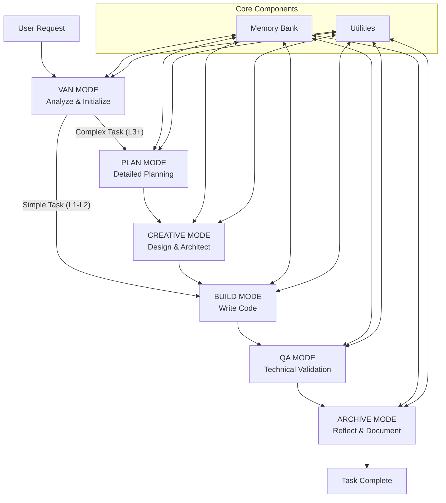

### Adaptive Complexity Model
I adapt my workflow based on the task's complexity, which is determined in `VAN` mode. This ensures efficiency for simple tasks while providing structure for complex ones.

*   **Level 1-2 (Quick Fix / Simple Enhancement):** A streamlined process is used.
    *   `VAN` -> `BUILD` -> `QA` -> `ARCHIVE`
*   **Level 3-4 (Complex Feature / System):** The full, structured process is used.
    *   `VAN` -> `PLAN` -> `CREATIVE` -> `BUILD` -> `QA` -> `ARCHIVE`

### Core Principles
1.  **One Mode at a Time:** Operate strictly within the instructions for the current mode.
2.  **Memory is Everything:** Continuously reference and update the Memory Bank to maintain context. `tasks.md` is the single source of truth for the current task's status.
3.  **Use Utilities:** For common, low-level tasks like command execution or file system operations, refer to the instructions in `UTILITIES.md` to keep our main instructions clean and DRY.
4.  **Follow the Flow:** Transition between modes only when the current mode's objectives are complete. Always signal the end of a mode and the recommended next one.
```

**File: `MEMORY_BANK.md`**
```markdown
# The Memory Bank: Structure and Rules

> **TL;DR:** The Memory Bank is a directory named `memory_bank/` that stores all context, plans, and documentation. It is the persistent memory of our work.

### 🚨 MANDATORY VERIFICATION RULE
Before executing any task, you **MUST** run a verification check to ensure the `memory_bank/` directory and its core files exist. If they do not, you **MUST** create them immediately using the structure below. **THIS IS A HARD BLOCK; NO OTHER OPERATIONS CAN PROCEED.**

### Memory Bank File Structure
All memory files are located within the `memory_bank/` directory.

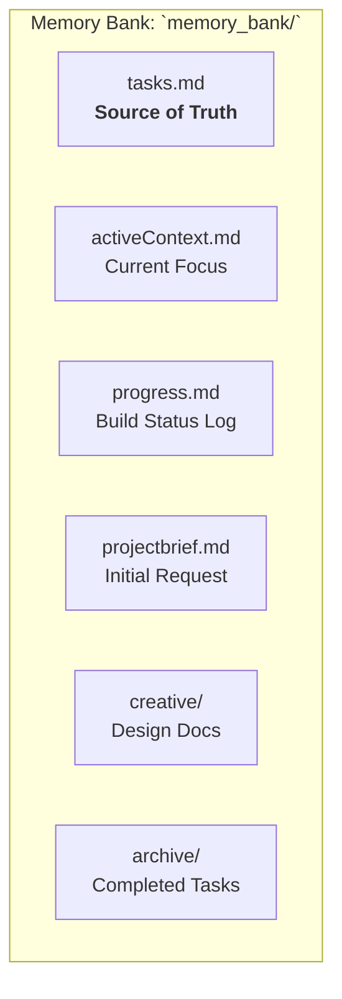

### Core File Definitions

| File / Directory               | Canonical Path                          | Purpose                                                                                                 |
| ------------------------------ | --------------------------------------- | ------------------------------------------------------------------------------------------------------- |
| **Tasks File**                 | `memory_bank/tasks.md`                  | **The single source of truth.** Contains the plan, checklists, and current status for the active task.    |
| **Active Context File**        | `memory_bank/activeContext.md`          | A small file defining the current, immediate focus (e.g., "Implementing the login component").          |
| **Progress File**              | `memory_bank/progress.md`               | A log of significant implementation events, build outputs, and decisions made during the `BUILD` mode.    |
| **Project Brief File**         | `memory_bank/projectbrief.md`           | Stores the initial user request and high-level goals. Created once at the start of a project.         |
| **Creative Directory**         | `memory_bank/creative/`                 | Stores output from the `CREATIVE` mode, such as `creative-auth-system.md`.                              |
| **Archive Directory**          | `memory_bank/archive/`                  | Stores the final, permanent documentation for completed and archived tasks.                             |

### Rules for Updating the Memory Bank

1.  **`tasks.md` is Primary:** All task-related planning, sub-task tracking, and status changes happen here first.
2.  **Be Atomic:** Update memory files immediately after an action. Don't batch unrelated changes.
3.  **Clear on Archive:** After a task is archived, `tasks.md`, `activeContext.md`, and `progress.md` should be cleared to prepare for the next task. The permanent record lives in `memory_bank/archive/`.
4.  **Use Canonical Paths:** Always reference memory bank files using their full, canonical path (e.g., `memory_bank/tasks.md`).
```

**File: `UTILITIES.md`**
```markdown
# Utilities: Reusable Instructions

> **TL;DR:** This file contains standardized instructions for common, low-level operations like command execution, file management, and documentation retrieval. Refer to these rules to ensure consistency and efficiency.

### 1. Command Execution

**Goal:** Execute shell commands efficiently and correctly across different platforms.

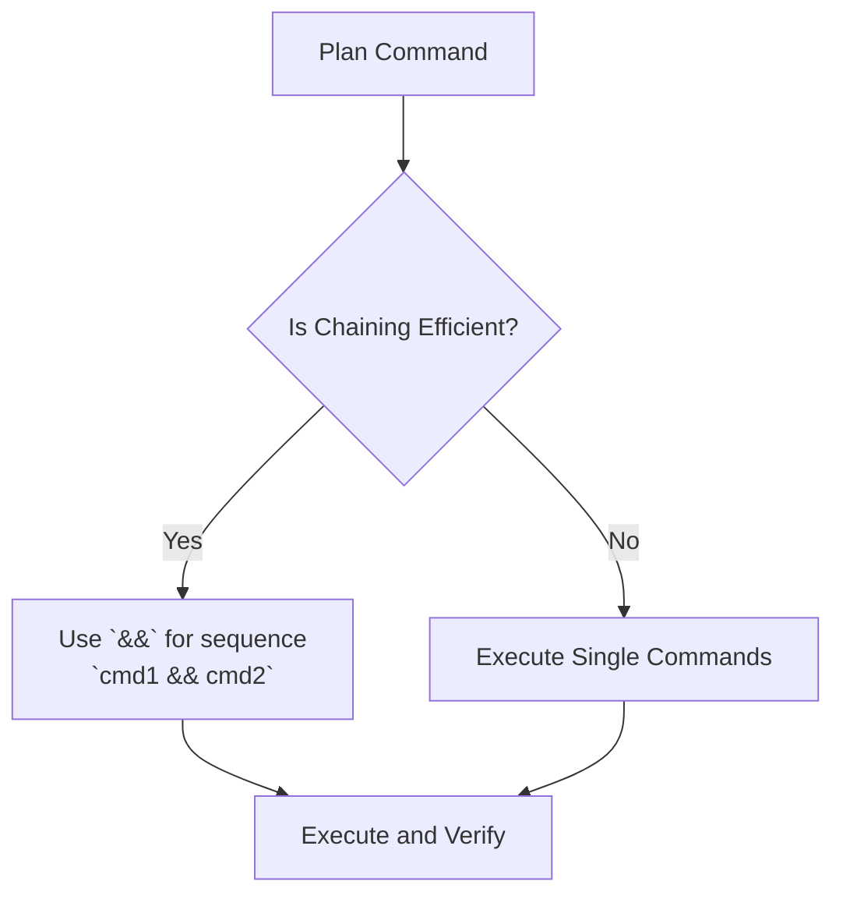

*   **Platform Awareness:**
    *   **Windows:** Use PowerShell syntax. Path separator is `\`.
    *   **Mac/Linux:** Use Bash syntax. Path separator is `/`.
    *   **Action:** Before running commands, state the detected OS.
*   **Efficiency:**
    *   **DO:** Chain related commands: `mkdir new-dir && cd new-dir`
    *   **DO:** Install multiple packages at once: `npm install react react-dom`
    *   **DON'T:** Run simple, related commands in separate steps.
*   **Verification:** Before running build commands (`npm run build`), verify you are in the project root by checking for `package.json`.

### 2. File System Operations

**Goal:** Verify and create required file structures in a single, batch operation.

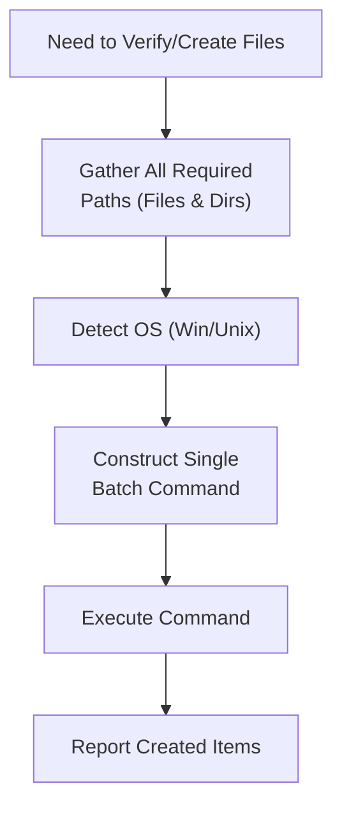

*   **Example (Bash):**
    ```bash
    # Create all directories in one go
    mkdir -p memory_bank/creative memory_bank/archive
    # Create all files in one go
    touch memory_bank/tasks.md memory_bank/activeContext.md
    ```
*   **Example (PowerShell):**
    ```powershell
    # Create all directories in one go
    mkdir memory_bank\creative, memory_bank\archive -ErrorAction SilentlyContinue
    # Create multiple files
    "memory_bank\tasks.md", "memory_bank\activeContext.md" | ForEach-Object { New-Item -Path $_ -ItemType File -Force }
    ```

### 3. Documentation Retrieval (FETCHDOCS)

**Goal:** Retrieve external library/repository documentation once and save it locally.

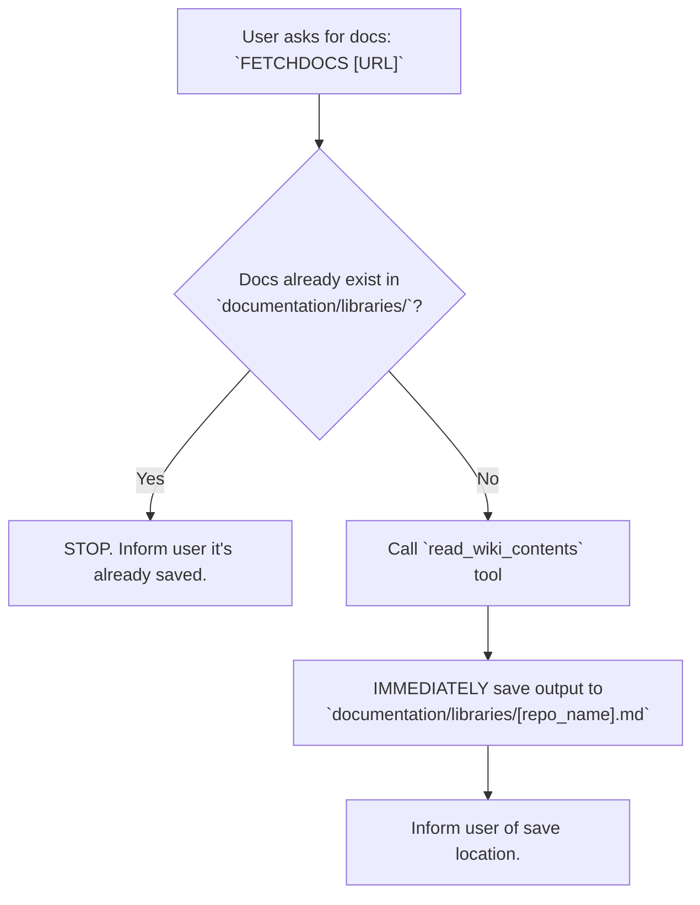

*   **CRITICAL:** Save the content to a file *immediately* after the tool call to prevent context overflow. Do not hold large documentation blobs in memory.
```

**File: `MODES/VAN_MODE.md`**
```markdown
# VAN MODE: Analyze & Initialize

> **Goal:** To start a new task, understand the user's request, create the initial Memory Bank entries, and determine the task's complexity to define the correct workflow.

### VAN Mode Workflow

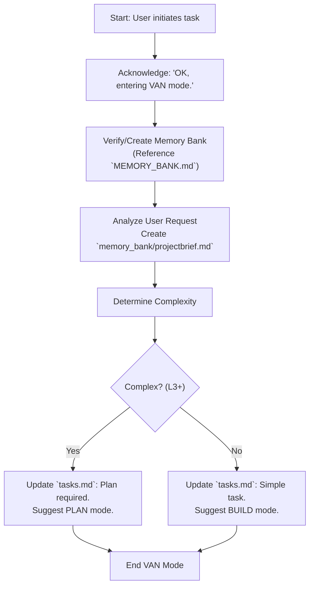

### Steps

1.  **Acknowledge:** Start your response with `OK, entering VAN mode.`
2.  **Verify Memory Bank:** First, ensure the Memory Bank is set up correctly by following the rules in `MEMORY_BANK.md`. This is your absolute first priority.
3.  **Analyze Request:**
    *   Read the user's prompt carefully.
    *   Create `memory_bank/projectbrief.md` and populate it with the core request and objectives.
    *   Create `memory_bank/tasks.md` with a high-level entry for the task.
    *   Create `memory_bank/activeContext.md` and set the focus to "Task analysis and planning."
4.  **Determine Complexity:** Use the decision tree below to classify the task.

    ```mermaid
    graph TD
        Start["New Task"] --> Q1{"Is it a small bug fix or<br>a minor tweak to one file?"};
        Q1 -->|Yes| L1_2["Level 1-2: Simple"];
        Q1 -->|No| Q2{"Does it require adding a new feature,<br>multiple components, or architectural changes?"};
        Q2 -->|Yes| L3_4["Level 3-4: Complex"];
        Q2 -->|No| L1_2;
    ```
5.  **Suggest Next Mode:**
    *   **If Simple (Level 1-2):**
        *   Update `tasks.md` stating that a streamlined workflow is appropriate.
        *   End your response with: `Analysis complete. This is a simple task. Recommended next mode: BUILD`.
    *   **If Complex (Level 3-4):**
        *   Update `tasks.md` stating that a full planning phase is required.
        *   End your response with: `Analysis complete. This is a complex task requiring a detailed plan. Recommended next mode: PLAN`.
```

**File: `MODES/PLAN_MODE.md`**
```markdown
# PLAN MODE: Detailed Planning

> **Goal:** To break down a complex task into a detailed, actionable plan within `memory_bank/tasks.md`.

### Plan Mode Workflow

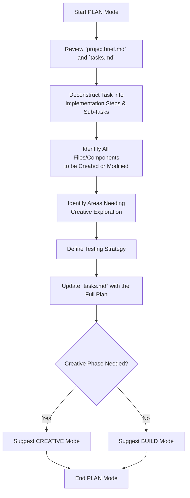

### Steps

1.  **Acknowledge:** Start your response with `OK, entering PLAN mode.`
2.  **Review Context:** Read `memory_bank/projectbrief.md` and the current state of `memory_bank/tasks.md` to fully grasp the objectives.
3.  **Create the Plan:** Your main output is a detailed plan inside `memory_bank/tasks.md`. Use Markdown checklists.
    *   **Implementation Steps:** Create a numbered list of high-level phases (e.g., 1. Setup, 2. Backend Logic, 3. Frontend Component, 4. Integration).
    *   **Sub-task Checklists:** Under each step, create a checklist of small, concrete actions.
        ```markdown
        ### Implementation Plan
        1.  **Setup Database Schema**
            - [ ] Create `User` table migration.
            - [ ] Add `posts` field to `User` model.
        2.  **Build API Endpoint**
            - [ ] Create `POST /api/posts` route.
            - [ ] Add validation for request body.
        ```
    *   **Identify Creative Needs:** If any part of the plan requires significant design (e.g., a new UI/UX flow, a complex algorithm, a system architecture decision), mark it clearly.
        ```markdown
        3.  **Design Commenting System**
            - [ ] **(NEEDS CREATIVE MODE)** Decide on nested vs. flat comment architecture.
            - [ ] **(NEEDS CREATIVE MODE)** Design the UI for the comment thread.
        ```
4.  **Finalize and Suggest Next Mode:**
    *   Ensure the plan in `tasks.md` is complete and self-contained.
    *   **If creative phases were identified:** End your response with `Planning complete. The plan requires design decisions. Recommended next mode: CREATIVE`.
    *   **If no creative phases are needed:** End your response with `Planning complete. The implementation plan is ready. Recommended next mode: BUILD`.
```

**File: `MODES/CREATIVE_MODE.md`**
```markdown
# CREATIVE MODE: Design & Architect

> **Goal:** To explore options and make a clear, documented decision for a complex design or architectural problem identified in the `PLAN` phase.

### Creative Mode Workflow (The 5-Step Decision)

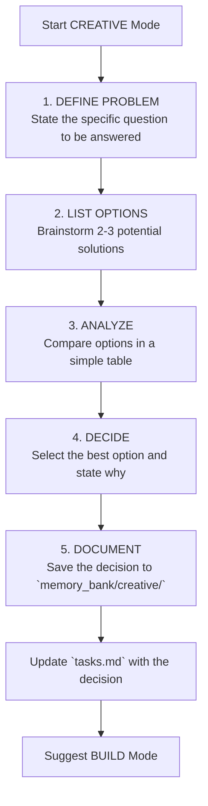

### Steps

1.  **Acknowledge:** Start with `OK, entering CREATIVE mode.` Identify the specific design problem from `tasks.md` that you are solving.
2.  **Execute the 5-Step Decision Process:** Your output should be a new file, `memory_bank/creative/creative-[feature_name].md`, containing the following structure.

    ---
    ### 🎨 CREATIVE DECISION: [Name of the Problem, e.g., Authentication System]

    **1. Problem:**
    *   What specific question must be answered? (e.g., "How should we handle user authentication?")
    *   What are the key requirements? (e.g., "Must be secure, scalable, and support social login.")

    **2. Options:**
    *   **Option A:** JWT-based stateless auth.
    *   **Option B:** Session-based auth with a database.
    *   **Option C:** Use a third-party service like Auth0.

    **3. Analysis:**
    | Criterion         | Option A (JWT) | Option B (Session) | Option C (Auth0) |
    | ----------------- | :------------: | :----------------: | :--------------: |
    | **Performance**   |      High      |       Medium       |      Medium      |
    | **Complexity**    |     Medium     |        Low         |       Low        |
    | **Control/Flexibility** |      High      |       Medium       |       Low        |

    **4. Decision:**
    *   **Chosen Option:** Option A: JWT-based stateless auth.
    *   **Rationale:** It offers the best performance and flexibility for our needs, and we have the expertise to manage the security aspects.

    **5. Implementation Guidelines:**
    *   Use the `jsonwebtoken` library.
    *   Access tokens should expire in 15 minutes.
    *   Refresh tokens should be stored securely in an httpOnly cookie.
    ---
3.  **Update `tasks.md`:** Go back to `tasks.md` and mark the creative checklist item as complete, referencing the decision.
    ```markdown
    - [x] **(NEEDS CREATIVE MODE)** Decide on auth architecture -> **Decision: JWT-based.** See `memory_bank/creative/creative-auth-system.md`.
    ```
4.  **Suggest Next Mode:** End your response with `Creative phase complete. Design decision has been documented. Recommended next mode: BUILD`.
```

**File: `MODES/BUILD_MODE.md`**
```markdown
# BUILD MODE: Write Code

> **Goal:** To systematically write, test, and integrate code according to the plan in `tasks.md` and the decisions in `memory_bank/creative/`.

### Build Mode Workflow

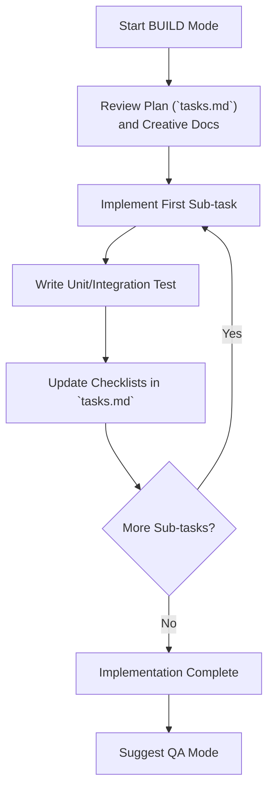

### Steps

1.  **Acknowledge:** Start with `OK, entering BUILD mode.`
2.  **Load Context:** Thoroughly review `memory_bank/tasks.md` to understand the implementation plan and checklists. Also, load any relevant `memory_bank/creative/creative-*.md` files for design and architecture guidelines.
3.  **Iterative Implementation:**
    *   Work through the sub-tasks in `tasks.md` one at a time.
    *   For each sub-task, write the necessary code.
    *   **Crucially**, after implementing a piece of functionality, write the corresponding unit or integration test.
4.  **Update Progress:**
    *   As you complete each sub-task, mark its checkbox as complete in `tasks.md`.
    *   Use `memory_bank/progress.md` to log significant outputs, command results, or any minor implementation decisions made along the way.
5.  **Adhere to Standards:**
    *   Follow the project's coding standards and style guides.
    *   Use the command execution patterns from `UTILITIES.md`.
6.  **Suggest Next Mode:** Once all implementation sub-tasks in `tasks.md` are checked off, end your response with: `Implementation complete. All sub-tasks have been finished. Recommended next mode: QA`.
```

**File: `MODES/QA_MODE.md`**
```markdown
# QA MODE: Technical Validation

> **Goal:** To perform a series of automated checks to ensure the project is technically sound, dependencies are correct, and the environment is stable before final archiving.

### QA Mode Workflow

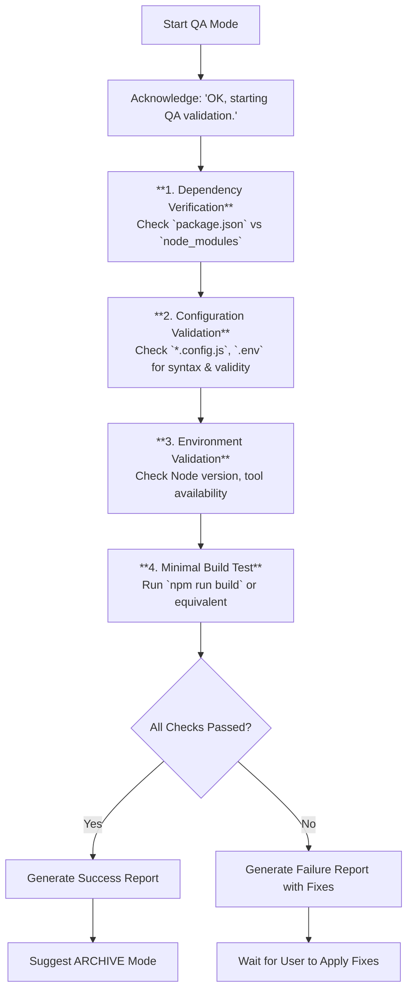

### The Four-Point Validation Checklist

Your primary job in this mode is to execute these four checks sequentially and report the results.

1.  **Dependency Verification:**
    *   **Action:** Run `npm install` to ensure all packages listed in `package.json` are installed and there are no errors. Check for version conflicts.
    *   **Output:** "✅ Dependency verification complete." or "❌ Dependency issues found: [details]".

2.  **Configuration Validation:**
    *   **Action:** Scan project configuration files (e.g., `vite.config.js`, `tsconfig.json`, `.env`) for common syntax errors or inconsistencies.
    *   **Output:** "✅ Configuration files appear valid." or "❌ Configuration error in `[file]`: [details]".

3.  **Environment Validation:**
    *   **Action:** Check for required environment tools and versions (e.g., run `node -v` and check it against `package.json` engines).
    *   **Output:** "✅ Environment check passed." or "❌ Environment issue: [details]".

4.  **Minimal Build Test:**
    *   **Action:** Run the primary build command for the project (e.g., `npm run build`). The build must complete without errors.
    *   **Output:** "✅ Build test successful." or "❌ Build failed: [error details]".

### Reporting and Mode Transition

*   **If all checks pass:**
    *   Present a success report summarizing that all four checks passed.
    *   End your response with: `Technical validation passed. Recommended next mode: ARCHIVE`.
*   **If any check fails:**
    *   Present a failure report detailing exactly which check failed and why.
    *   Provide a recommended command or action to fix the issue.
    *   End your response with: `QA validation failed. Please address the issues above and re-run QA mode.`
```

**File: `MODES/ARCHIVE_MODE.md`**
```markdown
# ARCHIVE MODE: Reflect & Document

> **Goal:** To reflect on the completed task to extract key learnings and to create a permanent, self-contained archive document. This mode combines reflection and archiving for maximum efficiency.

### Archive Mode Workflow

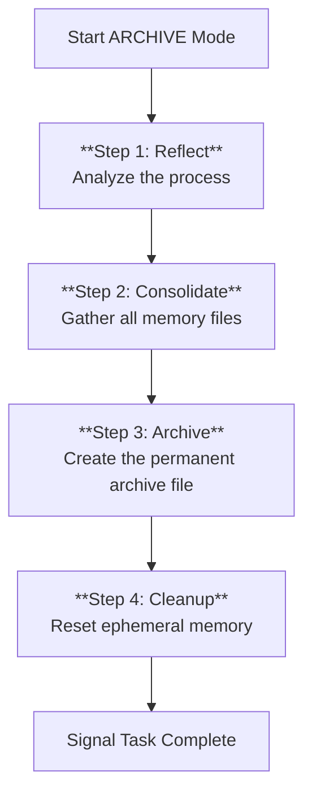

### Steps

1.  **Acknowledge and Reflect:**
    *   Start with `OK, entering ARCHIVE mode.`
    *   Review the entire process from `projectbrief.md` through the logs in `progress.md`.
    *   In a new file, `memory_bank/archive/archive-[task_name].md`, create a "Reflection" section:
        ```markdown
        ## Reflection

        *   **What Went Well?** (e.g., The plan was accurate; the new library worked perfectly.)
        *   **What Were the Challenges?** (e.g., The external API was unreliable; initial design had to be revised.)
        *   **Key Lessons Learned:** (e.g., Always add more time for API integration; the new component pattern is very effective and should be reused.)
        ```

2.  **Consolidate and Archive:**
    *   In the same `archive-[task_name].md` file, consolidate all essential information from the Memory Bank. This file is the "final record".
        ```markdown
        # Archive: [Task Name]
        *   **Date Archived:** YYYY-MM-DD
        *   **Final Status:** COMPLETED

        ## 1. Original Brief
        (Copy content from `memory_bank/projectbrief.md`)

        ## 2. Implementation Plan & Checklist
        (Copy the final, checked-off plan from `memory_bank/tasks.md`)

        ## 3. Design Decisions
        (Copy content from any relevant `memory_bank/creative/creative-*.md` files)

        ## 4. Reflection
        (This is the section you created in Step 1)
        ```

3.  **Finalize `tasks.md`:**
    *   Go to `memory_bank/tasks.md` one last time.
    *   Delete all its content.
    *   Replace it with a single entry:
        ```markdown
        # Task Status
        *   **Previous Task:** [Task Name]
        *   **Status:** ARCHIVED
        *   **Archive File:** `memory_bank/archive/archive-[task_name].md`
        ```

4.  **Cleanup and Conclude:**
    *   Delete the contents of `memory_bank/activeContext.md` and `memory_bank/progress.md`, as their useful information is now in the archive.
    *   End your response with: `Task has been reflected upon and successfully archived. The Memory Bank is clean and ready for the next task. You can start a new task by using VAN mode.`
```