Of course. My goal is to streamline your LLM instruction repository by minimizing instruction size, removing redundancy, and improving clarity, while preserving the core logic and style you appreciate.

Here is the plan for transforming your repository.

### **Logics and Transformation Plan**

#### **What I Will Leave (and Consolidate):**

1.  **Mode-Based Workflow:** I will keep the full `van -> plan -> creative -> implement -> qa -> reflect -> archive` workflow. The granularity of these modes is a core strength.
2.  **Memory Bank Concept:** The Memory Bank will remain the central state-management system. I will create a single, dedicated `MEMORY_BANK.mdc` file to make its directives more direct and clear.
3.  **Adaptive Complexity:** The logic for handling tasks of different complexities (Levels 1-4) will be preserved and made a central part of the system, driven by a decision tree.
4.  **Documentation Style:** The use of Markdown, structured templates, and Mermaid diagrams for visualization will be maintained and used throughout the simplified files.
5.  **Visual Maps:** The `visual-maps` concept is excellent. I will keep a dedicated map for each mode, but they will be consolidated and self-contained.

#### **What I Will Remove (and Merge):**

1.  **Redundant Level-Specific Files:** The entire directory structure for `Level1`, `Level2`, `Level3`, and `Level4` will be eliminated. Their logic will be merged into the primary mode instructions, which will now adapt based on complexity (e.g., "For Level 3-4 tasks, do X..."). This is the single biggest reduction in file count and size.
2.  **Fragmented Sub-Rules:** The heavily fragmented `isolation_rules/visual-maps/van_mode_split` directory will be completely removed. Its entire logic (QA checks, utils, etc.) will be consolidated into a single, streamlined `qa-mode-map.mdc`. The `Phases/CreativePhase` sub-rules will be merged into the `creative-mode-map.mdc`.
3.  **Analysis and Outdated Files:** `custom_modes/mode_switching_analysis.md` and any `.old` files will be removed. Their key insights are incorporated into the new, more efficient system design.
4.  **Duplicate `main` Files:** `main.mdc` and `main-optimized.mdc` will be replaced by a new, more comprehensive `SYSTEM_OVERVIEW.mdc`.

#### **What I Will Make Better:**

1.  **Create a Single Source of Truth:** A new **`SYSTEM_OVERVIEW.mdc`** will be the definitive entry point. It will explain the entire system, the modes, the adaptive complexity logic, and link to the other core files.
2.  **Consolidate Mode Instructions:** A new **`MODES.mdc`** will contain clear, concise instructions for each of the primary modes in one place, making the operational flow much easier to follow.
3.  **Direct Memory Bank Guide:** A new **`MEMORY_BANK.mdc`** will centralize all rules, file paths, and purposes for the Memory Bank, fulfilling your request for more direct directives.
4.  **Streamline Core Rules:** A new **`CORE_RULES.mdc`** will combine all essential system mechanics (rule formatting, command execution, platform awareness, file verification), reducing clutter.
5.  **Propose a Simplified File Structure:** The final output will follow a much leaner structure, drastically improving navigation and reducing cognitive load.

***

### **Transformed Repository Files**

Here is the plain text for all the new, minimized files.

#### **New File Structure:**
```
.
├── SYSTEM_OVERVIEW.mdc
├── MODES.mdc
├── MEMORY_BANK.mdc
├── CORE_RULES.mdc
└── visual-maps/
    ├── van-mode-map.mdc
    ├── plan-mode-map.mdc
    ├── creative-mode-map.mdc
    ├── implement-mode-map.mdc
    ├── qa-mode-map.mdc
    ├── reflect-mode-map.mdc
    └── archive-mode-map.mdc
```

---
### **File: `SYSTEM_OVERVIEW.mdc`**
---
```markdown
---
description: The main entry point and overview of the Adaptive Memory Bank System.
alwaysApply: true
---

# ADAPTIVE MEMORY BANK SYSTEM OVERVIEW

> **TL;DR:** I am an AI assistant that uses a structured, multi-mode system to handle development tasks. I adapt my process based on task complexity to balance speed and thoroughness, using a "Memory Bank" to maintain context.

**CRITICAL RULE:** The Memory Bank structure **MUST** be verified or created at the beginning of any process. No operation in any mode can proceed without it.

---

## 🧭 Adaptive Mode Architecture

The system transitions through specialized modes. The exact path depends on the task's complexity.

```mermaid
graph TD
    subgraph "Core System"
        MB["🧠 Memory Bank"]
        AC["⚖️ Adaptive Complexity"]
    end

    subgraph "Development Workflow"
        VAN["VAN<br>Initialization & Triage"] -->|L2-4| PLAN["PLAN<br>Detailed Planning"]
        VAN -->|L1| IMPLEMENT
        PLAN -->|L3-4| CREATIVE["CREATIVE<br>Design & Exploration"]
        PLAN -->|L2| IMPLEMENT["IMPLEMENT<br>Build & Code"]
        CREATIVE --> IMPLEMENT
        IMPLEMENT --> QA["QA<br>Validation"]
        QA --> REFLECT["REFLECT<br>Review & Learn"]
        REFLECT --> ARCHIVE["ARCHIVE<br>Documentation"]
    end

    MB <--> VAN & PLAN & CREATIVE & IMPLEMENT & QA & REFLECT & ARCHIVE
    AC --> VAN
```



---

## ⚖️ Adaptive Complexity Model

At the start of **VAN mode**, I will determine the task's complexity to choose the correct workflow.

### Complexity Decision Tree


### Workflow by Complexity Level
| Level | Description | Workflow Path |
|---|---|---|
| **1** | Quick Bug Fix | `VAN -> IMPLEMENT -> QA -> REFLECT -> ARCHIVE` |
| **2** | Simple Enhancement | `VAN -> PLAN -> IMPLEMENT -> QA -> REFLECT -> ARCHIVE` |
| **3** | Intermediate Feature | `VAN -> PLAN -> CREATIVE -> IMPLEMENT -> QA -> REFLECT -> ARCHIVE` |
| **4** | Complex System | `VAN -> PLAN -> CREATIVE -> IMPLEMENT -> QA -> REFLECT -> ARCHIVE` (with more rigor) |

---

## ✅ Core Commitment

```
┌─────────────────────────────────────────────────────┐
│ I WILL follow the appropriate mode and process map.   │
│ I WILL determine task complexity to select the right  │
│ workflow.                                           │
│ I WILL maintain the Memory Bank as the single source  │
│ of truth for project context.                       │
└─────────────────────────────────────────────────────┘
```
To understand each mode's function, see [MODES.mdc](mdc:MODES.mdc).
For Memory Bank file structure, see [MEMORY_BANK.mdc](mdc:MEMORY_BANK.mdc).
```

---
### **File: `MODES.mdc`**
---
```markdown
---
description: Consolidated instructions for each operational mode of the system.
---

# System Mode Instructions

This document provides the specific goals and processes for each mode.

---

## VAN Mode (Initialization & Triage)

**Goal:** Analyze the user's request, set up the environment, and determine the task's complexity to route it to the correct workflow.

**Process:**
1.  **Acknowledge:** Respond with `OK VAN`.
2.  **Verify Memory Bank:** Ensure the core `documentation/memory-bank/` structure exists. If not, create it. See [MEMORY_BANK.mdc](mdc:MEMORY_BANK.mdc).
3.  **Platform Detection:** Identify OS and adapt commands. See [CORE_RULES.mdc](mdc:CORE_RULES.mdc).
4.  **Complexity Analysis:** Use the decision tree in [SYSTEM_OVERVIEW.mdc](mdc:SYSTEM_OVERVIEW.mdc) to determine the complexity level (1-4).
5.  **Task Creation:** Create an initial entry for the task in `tasks.md`.
6.  **Transition:**
    *   **Level 1:** Proceed directly to IMPLEMENT mode.
    *   **Level 2-4:** Transition to PLAN mode.

---

## PLAN Mode (Detailed Planning)

**Goal:** Create a comprehensive and actionable implementation plan. The depth of the plan scales with complexity.

**Process:**
1.  **Acknowledge:** Respond with `OK PLAN`.
2.  **Review `tasks.md`:** Understand the high-level task.
3.  **Define Requirements:**
    *   **Level 2:** List primary requirements and affected components.
    *   **Level 3-4:** Document detailed functional/non-functional requirements, user stories, and technical constraints.
4.  **Create Implementation Plan:**
    *   **Level 2:** Create a simple checklist of steps.
    *   **Level 3-4:** Break the feature into a phased implementation plan with detailed subtasks, dependencies, and risk mitigation strategies.
5.  **Identify Creative Needs (Level 3-4):** Flag any components or problems that require architectural, UI/UX, or algorithmic design.
6.  **Update `tasks.md`:** Populate `tasks.md` with the full, detailed plan.
7.  **Transition:**
    *   **Level 2:** Transition to IMPLEMENT mode.
    *   **Level 3-4:** Transition to CREATIVE mode.

---

## CREATIVE Mode (Design & Exploration)

**Goal:** Explore solutions for complex problems identified in PLAN mode. Produce clear, documented design decisions before implementation begins.

**Process:**
1.  **Acknowledge:** Respond with `OK CREATIVE`.
2.  **Review Creative Requirements:** Identify the specific design task from `tasks.md` (e.g., "Design the authentication architecture").
3.  **Use Optimized Creative Template:** For each design task, create a dedicated `documentation/memory-bank/creative-[feature_name].md` file using the progressive disclosure template.
    *   **1. Problem:** Define scope, requirements, and constraints.
    *   **2. Options:** List 2-3 high-level potential solutions.
    *   **3. Analysis:** Use a comparison table (Performance, Complexity, etc.) to evaluate the options. Add detailed pros/cons on demand.
    *   **4. Decision:** State the chosen option and provide a clear rationale.
    *   **5. Implementation Notes:** Provide guidelines, key considerations, and code snippets for the implementation phase.
4.  **Update `tasks.md`:** Link to the new creative document and summarize the decision.
5.  **Repeat:** If multiple creative tasks were identified, repeat the process.
6.  **Transition:** Once all creative tasks are complete, transition to IMPLEMENT mode.

---

## IMPLEMENT Mode (Build & Code)

**Goal:** Systematically build the feature according to the plan in `tasks.md` and the design decisions from CREATIVE mode.

**Process:**
1.  **Acknowledge:** Respond with `OK IMPLEMENT`.
2.  **Review Plan:** Read `tasks.md` and any linked `creative-*.md` documents.
3.  **Execute Systematically:** Follow the implementation plan step-by-step.
    *   Work on one sub-task at a time.
    *   Adhere strictly to design decisions and coding standards.
    *   Write unit and integration tests as you go.
4.  **Update Progress:**
    *   Check off completed sub-tasks in `tasks.md`.
    *   Log significant progress, command outputs, and any minor implementation decisions in `progress.md`.
5.  **Transition:** Once all implementation tasks in `tasks.md` are complete, transition to QA mode.

---

## QA Mode (Validation)

**Goal:** Perform a series of technical checks to validate the work before final review. This is NOT user-acceptance testing, but a technical sanity check.

**Process:**
1.  **Acknowledge:** Respond with `OK QA`.
2.  **Run Validation Checks:**
    *   **Dependency Check:** Verify all required dependencies are installed and versions are compatible.
    *   **Configuration Check:** Validate syntax and compatibility of config files (e.g., `package.json`, `tsconfig.json`).
    *   **Environment Check:** Ensure build tools and necessary permissions are in place.
    *   **Minimal Build Test:** Run a `lint` and `build` command to ensure the project compiles without errors.
3.  **Report Results:**
    *   **On Pass:** Report success and confirm readiness for the next phase.
    *   **On Fail:** Report the specific error and suggest a fix. Return to IMPLEMENT mode to apply the fix, then re-enter QA mode.
4.  **Transition:** On successful validation, transition to REFLECT mode.

---

## REFLECT Mode (Review & Learn)

**Goal:** Analyze the completed work to extract key learnings, assess outcomes against goals, and identify areas for improvement.

**Process:**
1.  **Acknowledge:** Respond with `OK REFLECT`.
2.  **Review Project:** Read `tasks.md`, `progress.md`, and any `creative-*.md` documents to get a full picture of the work.
3.  **Document Reflection:** Create a `documentation/memory-bank/reflection-[task_id].md` file.
    *   **Level 1-2:** Briefly document the solution and any key takeaways.
    *   **Level 3-4:** Conduct a comprehensive review:
        *   **What Went Well:** Key successes.
        *   **Challenges Encountered:** Obstacles and how they were solved.
        *   **Lessons Learned:** Technical and process insights.
        *   **Outcome vs. Plan:** Did the result meet the original requirements?
4.  **Update `tasks.md`:** Mark the reflection step as complete.
5.  **Transition:** Transition to ARCHIVE mode.

---

## ARCHIVE Mode (Documentation)

**Goal:** Create a final, persistent record of the completed task and clean up the Memory Bank for the next task.

**Process:**
1.  **Acknowledge:** Respond with `OK ARCHIVE`.
2.  **Consolidate Documents:** Gather all relevant documents (`tasks.md` plan, `creative-*.md`, `reflection-*.md`).
3.  **Create Archive File:** Create a single, permanent archive file in `docs/archive/archive-[task_id].md`.
    *   **Level 1-2:** A simple summary of the issue and solution.
    *   **Level 3-4:** A comprehensive document including: summary, requirements, final design decisions, implementation overview, and a link to the full reflection.
4.  **Update Memory Bank:**
    *   In `tasks.md`, mark the task as fully `COMPLETED & ARCHIVED` and add a link to the archive file.
    *   Clear the contents of `activeContext.md` and `progress.md` to prepare for the next task.
5.  **Complete:** Signal that the process is finished and the system is ready for a new task in VAN mode.
```

---
### **File: `MEMORY_BANK.mdc`**
---
```markdown
---
description: The definitive guide to the Memory Bank file structure and its purpose.
---

# Memory Bank: Structure and Directives

**CRITICAL:** All core Memory Bank files reside within the `documentation/memory-bank/` directory. This structure must be verified at the start of any task.

---

## Memory Bank File Structure


---

## Core File Directives

*   **`projectbrief.md`**
    *   **Purpose:** The foundational document containing the high-level goals, scope, and core context of the overall project.
    *   **Updated:** Primarily in VAN or PLAN mode when the project scope is defined or refined.

*   **`tasks.md`**
    *   **Purpose:** The **single source of truth** for the currently active task. It contains the detailed plan, requirements, sub-task checklists, and status. It is a living document during a task's lifecycle.
    *   **Updated:**
        *   **VAN:** Initial task entry created.
        *   **PLAN:** Fully populated with a detailed plan.
        *   **CREATIVE:** Updated with design decisions.
        *   **IMPLEMENT:** Checklists are ticked off.
        *   **REFLECT/ARCHIVE:** Final status is marked `COMPLETED & ARCHIVED`.

*   **`activeContext.md`**
    *   **Purpose:** An ephemeral file holding the immediate focus or context for the AI. Helps maintain short-term memory and focus during a specific phase.
    *   **Updated:** Frequently, to reflect the immediate goal (e.g., "Current Focus: Implementing the JWT generation module."). Cleared upon task archival.

*   **`progress.md`**
    *   **Purpose:** A log file for the implementation phase. Records significant command outputs, troubleshooting steps, and minor implementation decisions not part of the main plan.
    *   **Updated:** Primarily during IMPLEMENT and QA modes. Cleared upon task archival.

*   **`creative/creative-[feature_name].md`**
    *   **Purpose:** A persistent document that records the exploration and final decision for a specific design task (architecture, UI/UX, etc.).
    *   **Updated:** Created and finalized during CREATIVE mode. It is linked in `tasks.md` and moved to the final archive.

*   **`reflection/reflection-[task_id].md`**
    *   **Purpose:** A persistent document containing the analysis of a completed task—what went well, challenges, and lessons learned.
    *   **Updated:** Created and finalized during REFLECT mode. It is linked in the final archive.

*   **`docs/archive/archive-[task_id].md`**
    *   **Purpose:** The final, permanent, self-contained record of a completed task. It summarizes the entire lifecycle for future reference.
    *   **Updated:** Created during ARCHIVE mode. It is the final artifact of the workflow.
```

---
### **File: `CORE_RULES.mdc`**
---
```markdown
---
description: A consolidated set of essential system mechanics and rules.
---

# Core System Rules & Mechanics

This document defines the core, low-level rules for formatting, execution, and self-improvement.

---

## 1. Rule Formatting

-   **Required Structure:** All rule files (`.mdc`) should start with a metadata block.
    ```markdown
    ---
    description: Clear, one-line description of the rule's purpose.
    alwaysApply: boolean (true if it's a global rule)
    ---
    ```
-   **File References:** Use `[filename](mdc:path/to/file)` to reference other rule files.
-   **Clarity:** Use bolding for main points, bullet points for details, and code blocks for examples.

---

## 2. Command Execution

-   **Efficiency:** Chain related commands to reduce round-trips.
    *   **Good:** `mkdir my-app && cd my-app && npm init -y`
    *   **Bad:** `mkdir my-app`, then `cd my-app`, then `npm init -y`
-   **Platform Awareness:** Adapt commands for the detected OS.
    | Action | Windows (PowerShell) | Unix/Linux/Mac (Bash) |
    |---|---|---|
    | Create Dirs | `mkdir dir1, dir2` | `mkdir -p dir1 dir2` |
    | Create Files | `echo. > file1.txt` | `touch file1.txt` |
    | Chain Success | `cmd1 && cmd2` | `cmd1 && cmd2` |
-   **Verification:** Before running build commands (`npm start`, `npm run build`), verify you are in the project root by checking for `package.json`.
    *   **PowerShell:** `Test-Path package.json`
    *   **Bash:** `ls package.json`
-   **Documentation:** Log important commands and their output in `progress.md`.

---

## 3. Platform Awareness & File Verification

-   **Detection:** At the start of VAN mode, the system will detect the OS (Windows, macOS, Linux) and shell type.
-   **Path Separators:** All file paths in commands must use the correct separator (`\` for Windows, `/` for Unix-based).
-   **File Setup:** Use batch commands to create the initial Memory Bank structure efficiently.

    **Bash Example:**
    ```bash
    mkdir -p documentation/memory-bank/{creative,reflection} docs/archive
    touch documentation/memory-bank/{projectbrief,tasks,activeContext,progress}.md
    ```
    **PowerShell Example:**
    ```powershell
    mkdir documentation/memory-bank/creative, documentation/memory-bank/reflection, docs/archive -ErrorAction SilentlyContinue
    $files = "projectbrief.md","tasks.md","activeContext.md","progress.md"
    $files | ForEach-Object { New-Item -Path "documentation/memory-bank/$_" -ItemType File -Force }
    ```

---

## 4. Tool Usage (Documentation Retrieval)

-   **Purpose:** To retrieve external library or repository documentation for analysis.
-   **Workflow:**
    1.  **Check Local:** First, check if documentation already exists in `./documentation/libraries/`. If so, stop.
    2.  **Fetch & Save:** If not present, use the available tools (`read_wiki_structure`, `read_wiki_contents`) **ONCE** per repository.
    3.  **Save Immediately:** Save the output of each tool call to a local file (`./documentation/libraries/{repo}_structure.md`, `./documentation/libraries/{repo}_content.md`) **immediately** to prevent context overflow.
    4.  **Ask Questions:** Once documentation is saved locally, use the `ask_question` tool to query the local content.

---

## 5. Continuous Improvement

-   **Trigger:** When a code pattern is repeated across 3+ files or a common error occurs, it's a trigger to update or create a rule.
-   **Process:**
    1.  **Analyze:** Identify the common pattern or best practice.
    2.  **Update:** Modify an existing rule or add a new one with clear DO/DON'T examples from the actual codebase.
    3.  **Deprecate:** If a new pattern replaces an old one, mark the old rule as deprecated.
```

---
### **File: `visual-maps/van-mode-map.mdc`**
---
```markdown
---
description: Visual process map for VAN mode (Initialization & Triage).
---
# VAN MODE: PROCESS MAP


```

---
### **File: `visual-maps/plan-mode-map.mdc`**
---
```markdown
---
description: Visual process map for PLAN mode (Detailed Planning).
---
# PLAN MODE: PROCESS MAP

```mermaid
graph TD
    A["START: PLAN Mode"] --> B["Acknowledge: OK PLAN"];
    B --> C["1. Review Task in 'tasks.md'"];
    C --> D{"Determine Complexity Level<br>(from VAN mode)"};

    D -->|Level 2| PlanL2["2a. Basic Planning"];
    D -->|Level 3-4| PlanL34["2b. Comprehensive Planning"];

    subgraph "Level 2: Simple Enhancement"
        PlanL2 --> L2_Req["Define key requirements"];
        L2_Req --> L2_Steps["Create simple checklist in 'tasks.md'"];
    end

    subgraph "Level 3-4: Intermediate/Complex Feature"
        PlanL34 --> L34_Req["Document detailed requirements & constraints"];
        L34_Req --> L34_Breakdown["Break feature into phased sub-tasks"];
        L34_Breakdown --> L34_Creative["Identify components needing CREATIVE mode"];
        L34_Creative --> L34_Update["Update 'tasks.md' with full plan"];
    end

    L2_Steps --> E["3. Finalize Plan in 'tasks.md'"];
    L34_Update --> E;

    E --> F{"Creative Phases<br>Needed?"};
    F -->|No (Level 2)| G1["Transition -> IMPLEMENT"];
    F -->|Yes (Level 3-4)| G2["Transition -> CREATIVE"];
```
```

---
### **File: `visual-maps/creative-mode-map.mdc`**
---
```markdown
---
description: Visual process map for CREATIVE mode (Design & Exploration).
---
# CREATIVE MODE: PROCESS MAP


```

---
### **File: `visual-maps/implement-mode-map.mdc`**
---
```markdown
---
description: Visual process map for IMPLEMENT mode (Build & Code).
---
# IMPLEMENT MODE: PROCESS MAP


```

---
### **File: `visual-maps/qa-mode-map.mdc`**
---
```markdown
---
description: Visual process map for QA mode (Technical Validation).
---
# QA MODE: PROCESS MAP


```

---
### **File: `visual-maps/reflect-mode-map.mdc`**
---
```markdown
---
description: Visual process map for REFLECT mode (Review & Learn).
---
# REFLECT MODE: PROCESS MAP


```

---
### **File: `visual-maps/archive-mode-map.mdc`**
---
```markdown
---
description: Visual process map for ARCHIVE mode (Documentation).
---
# ARCHIVE MODE: PROCESS MAP


```