Of course. Here is the requested file structure and the contents of each file.

### **New Repository Structure**

```
/
├── main.md
├── _meta_rules.md
└── modes/
    ├── core_utilities.md
    ├── van_mode.md
    ├── plan_mode.md
    ├── creative_mode.md
    ├── implement_mode.md
    ├── qa_mode.md
    ├── reflect_archive_mode.md
```

---
### **File Contents**

#### `main.md`
```markdown
# Minimized LLM Workflow System

> **TL;DR:** This is a structured, mode-based system for guiding LLM development tasks. It optimizes for token efficiency by using consolidated, role-specific instructions. Start every new task with `van`.

## Core Philosophy

This system balances structured development with token efficiency. It achieves this by:
1.  **Mode-Based Granularity:** Isolating different phases of work (planning, creating, building) into distinct modes.
2.  **File Consolidation:** Merging dozens of small rule files into a handful of comprehensive mode guides.
3.  **Concise Instructions:** Using Markdown, tables, and Mermaid diagrams for clear, low-token communication.

## The Workflow Modes

The development lifecycle is broken down into a series of modes. You transition from one to the next as the task progresses.

```mermaid
graph TD
    A["START<br>User Request"] --> B(van_mode);
    B -- Complexity Level 1 --> E(implement_mode);
    B -- Complexity Level 2+ --> C(plan_mode);
    C --> D(creative_mode);
    D --> E;
    E --> F(qa_mode);
    F --> G(reflect_archive_mode);
    G --> H("END<br>Ready for New Task");

    subgraph "Core Modes"
        B["`van` - Analyze & Triage"];
        C["`plan` - Create Detailed Plan"];
        D["`creative` - Design & Architect"];
        E["`implement` - Build & Code"];
        F["`qa` - Validate Setup"];
        G["`reflect & archive` - Learn & Document"];
    end
```

### How to Use This System
1.  **Start with `van_mode.md`:** For any new task, begin with the VAN mode to define the scope and determine complexity.
2.  **Follow the Mode Path:** The VAN mode will direct you to either PLAN or IMPLEMENT mode. Follow the sequence from there.
3.  **Reference `core_utilities.md`:** For common tasks like command execution or file operations, refer to the core utilities guide.

**Mode Files:**
-   **[modes/van_mode.md](mdc:modes/van_mode.md):** Task intake, complexity analysis.
-   **[modes/plan_mode.md](mdc:modes/plan_mode.md):** Detailed planning and technical validation.
-   **[modes/creative_mode.md](mdc:modes/creative_mode.md):** Architectural, UI/UX, and algorithmic design.
-   **[modes/implement_mode.md](mdc:modes/implement_mode.md):** Writing code and building the feature.
-   **[modes/qa_mode.md](mdc:modes/qa_mode.md):** Pre-build technical validation (dependencies, config).
-   **[modes/reflect_archive_mode.md](mdc:modes/reflect_archive_mode.md):** Post-build review, learning, and final documentation.

**Utility & Meta Files:**
-   **[modes/core_utilities.md](mdc:modes/core_utilities.md):** Reusable instructions for command execution, platform awareness, etc.
-   **[_meta_rules.md](mdc:_meta_rules.md):** Guidelines for maintaining and improving this ruleset.
```

---
#### `_meta_rules.md`
```markdown
# Meta-Rules for Instruction Maintenance

> **TL;DR:** Guidelines for creating and improving this instruction set to ensure consistency, clarity, and effectiveness.

## Rule Structure and Formatting
- **Main Points in Bold:** With sub-points for detail.
- **File References:** Use `[filename](mdc:path/to/file)`.
- **Code Examples:** Use language-specific, fenced code blocks with DO/DON'T examples.
- **Diagrams:** Use MermaidJS for workflows and structures.
- **Headers:** Use `#`, `##`, `###` for clear, hierarchical sections.

## Rule Content Guidelines
- Start with a high-level overview or a `> **TL;DR:**` summary.
- Include specific, actionable requirements.
- Keep rules DRY (Don't Repeat Yourself) by referencing `core_utilities.md` or other modes.

## Continuous Improvement Process
- **Triggers for Updates:**
    - New code patterns emerge that aren't covered.
    - Common errors could be prevented by a better rule.
    - A new library or tool is adopted.
- **Analysis Process:**
    - Identify patterns that need to be standardized.
    - Compare new code with existing rules to find gaps.
- **Rule Updates:**
    - **Add** new rules when a pattern is used in 3+ instances.
    - **Modify** existing rules when better examples are found or edge cases are discovered.
- **Deprecation:** Mark outdated patterns as deprecated and provide migration paths.
```

---
#### `modes/core_utilities.md`
```markdown
# Core Utilities and Operations

> **TL;DR:** This is a collection of common, reusable instructions for file operations, command execution, and platform awareness that are referenced by all modes.

## 1. Memory Bank & File Structure

**CRITICAL:** All core Memory Bank files reside within the `documentation/memory-bank/` directory.

-   **Tasks File:** `documentation/memory-bank/tasks.md` (The single source of truth for task status)
-   **Active Context:** `documentation/memory-bank/activeContext.md`
-   **Creative Docs:** `documentation/memory-bank/creative/`
-   **Archive:** `documentation/memory-bank/archive/`

### File Verification & Creation

Use batch operations to efficiently verify and create the required file structure.

```mermaid
graph TD
    Start["Verify Structure"] --> Check{"Missing<br>Components?"};
    Check -->|"No"| Complete["✓ Verified"];
    Check -->|"Yes"| BatchCreate["Batch Create<br>All Missing Items"];
    BatchCreate --> Report["Report Creation"] --> Complete;
```



**Bash/Zsh (Mac/Linux):**
```bash
# Create directories and files in one go
mkdir -p documentation/memory-bank/creative docs/archive
touch tasks.md documentation/memory-bank/activeContext.md documentation/memory-bank/progress.md
```

**PowerShell (Windows):**
```powershell
# Create directories
mkdir documentation\memory-bank, docs, docs\archive -ErrorAction SilentlyContinue
# Create files
$files = "tasks.md", "documentation\memory-bank\activeContext.md", "documentation\memory-bank\progress.md"
foreach ($file in $files) {
    if (-not (Test-Path $file)) { New-Item -Path $file -ItemType File -Force }
}
```

## 2. Command Execution

Balance clarity and token optimization. Use command chaining for efficiency.

### Command Chaining Patterns
| Pattern | Format | Example | Use Case |
|---|---|---|---|
| **Sequential** | `cmd1 && cmd2` | `mkdir dir && cd dir` | Run `cmd2` only if `cmd1` succeeds. |
| **Piping** | `cmd1 \| cmd2` | `ls \| grep ".md"` | Use output of `cmd1` as input for `cmd2`. |
| **Conditional**| `cmd1 \|\| cmd2` | `test -f file.txt \|\| touch file.txt` | Run `cmd2` only if `cmd1` fails. |
| **Multi-arg** | `cmd arg1 arg2` | `npm install lib1 lib2` | Use a command's built-in multi-argument support. |

### Command Documentation
When showing work, document commands and their results concisely.
```markdown
### Command: Create React App
`npm create vite@latest my-react-app -- --template react`
**Result:** Successfully created a new React project in `./my-react-app`.
**Next:** Proceed with `cd my-react-app && npm install`.
```

## 3. Platform Awareness

Detect the OS and adapt commands accordingly.


```

---
#### `modes/van_mode.md`
```markdown
# VAN Mode: Analyze & Triage

> **TL;DR:** Use this mode to analyze a new task, determine its complexity, and decide the correct workflow path. This is the starting point for ALL tasks.

## 1. Task Intake & Complexity Analysis

First, analyze the user's request to determine its complexity level. This decision dictates the entire workflow.


### Complexity Level Indicators

| Level | Keywords | Scope | Example | Next Mode |
|---|---|---|---|---|
| **1: Quick Fix** | fix, bug, error | Single component | Fix a broken button | **IMPLEMENT** |
| **2: Enhancement**| add, improve, update | 1-2 components | Add a new field to a form | **PLAN** |
| **3: Feature** | implement, create | Multiple components | Build a user profile page | **PLAN** |
| **4: System** | architecture, redesign | System-wide | Implement a new auth system | **PLAN** |

## 2. Initial Setup (All Levels)

Before transitioning, perform these initial setup steps. Reference **[core_utilities.md](mdc:modes/core_utilities.md)** for detailed commands.

1.  **Verify/Create Memory Bank:** Ensure the `documentation/memory-bank/` directory and its core files (`tasks.md`, `activeContext.md`) exist. This is a **mandatory** step.
2.  **Initialize `tasks.md`:** Create an entry for the new task, including a brief description and the determined complexity level.
3.  **Update `activeContext.md`:** Set the current focus to the new task.

## 3. Transition to Next Mode

Based on the complexity assessment, announce the transition.

-   **If Level 1:**
    > "This is a Level 1 task. Transitioning directly to **IMPLEMENT** mode. See [implement_mode.md](mdc:modes/implement_mode.md)."

-   **If Level 2, 3, or 4:**
    > "This is a Level [2/3/4] task. Planning is required. Transitioning to **PLAN** mode. See [plan_mode.md](mdc:modes/plan_mode.md)."
```

---
#### `modes/plan_mode.md`
```markdown
# PLAN Mode: Task Planning

> **TL;DR:** Use this mode to create a detailed implementation plan. The depth of the plan depends on the complexity level determined in VAN mode. This mode concludes with a mandatory technology validation step.

## 1. Planning by Complexity Level

Refer to `tasks.md` for the complexity level and create a plan with the appropriate detail.

### Level 2: Simple Enhancement Plan
- **Goal:** Document the changes and create a simple checklist.
- **`tasks.md` update:**
  ```markdown
  ### Plan: [Enhancement Name]
  - **Objective:** [Briefly describe the goal]
  - **Affected Files:**
    - `path/to/file1.js`
  - **Checklist:**
    - [ ] Implement the UI change.
    - [ ] Add basic unit test.
    - [ ] Verify in browser.
  ```

### Level 3: Intermediate Feature Plan
- **Goal:** Break the feature into components, define requirements, and identify parts that need creative exploration.
- **`tasks.md` update:**
  ```markdown
  ### Plan: [Feature Name]
  - **Requirements:**
    - [ ] User can upload an avatar.
    - [ ] Image must be < 2MB.
  - **Component Breakdown:**
    - `AvatarUploadButton.tsx`: Handles file selection.
    - `ImagePreview.tsx`: Shows the selected image.
    - `useAvatarUpload.ts`: Hook for upload logic.
  - **Creative Phases Required:**
    - [ ] UI/UX for the upload modal.
  - **Implementation Steps:**
    - [ ] Build UI components.
    - [ ] Implement the upload hook with API call.
    - [ ] Add state management.
    - [ ] Write integration tests.
  ```

### Level 4: Complex System Plan
- **Goal:** Create an architectural plan, define subsystems, map dependencies, and assess risks.
- In addition to the Level 3 items, add:
  - **Architecture Diagrams:** Use MermaidJS to show component/data flow.
  - **Phased Rollout:** Plan for a staged implementation.
  - **Risk Assessment:** Document potential risks and mitigation strategies.

## 2. Technology Validation (Mandatory Gate)

Before finishing the PLAN phase, you **must** validate the chosen technology stack. This prevents major issues during implementation.

```mermaid
graph TD
    A["Select Tech Stack"] --> B["Create 'Hello World'<br>Proof of Concept"];
    B --> C{"Build & Run<br>Successful?"};
    C -->|"No"| D["Fix Setup/Config<br>Issues"];
    D --> B;
    C -->|"Yes"| E["✓ Tech Validated"];
```



### Tech Validation Checklist
-   [ ] Project initialization command verified (`npm create vite@latest`).
-   [ ] Required dependencies identified and installed (`npm install`).
-   [ ] "Hello World" app builds and runs successfully (`npm run dev`).
-   [ ] **`tasks.md`** updated to confirm technology stack is validated.

## 3. Transition to Next Mode

-   **If Creative Phases were identified:**
    > "Planning complete and technology validated. Creative exploration is required. Transitioning to **CREATIVE** mode. See [creative_mode.md](mdc:modes/creative_mode.md)."
-   **If No Creative Phases are needed:**
    > "Planning complete and technology validated. Ready for implementation. Transitioning to **IMPLEMENT** mode. See [implement_mode.md](mdc:modes/implement_mode.md)."
```

---
#### `modes/creative_mode.md`
```markdown
# CREATIVE Mode: Design & Architecture

> **TL;DR:** Use this mode to explore solutions for complex problems identified in the PLAN phase. Produce a clear, documented decision before implementation.

## The Creative Process

Follow this structured process for each creative task (e.g., UI/UX design, architecture).


## Creative Documentation Template

For each creative task, create a corresponding file (e.g., `documentation/memory-bank/creative/auth-architecture.md`) using this token-efficient template.

```markdown
📌 **CREATIVE PHASE: [Component or System Name]**
━━━━━━━━━━━━━━━━━━━━━━━━━━━━━━━

**1️⃣ PROBLEM**
-   **Description:** [Briefly describe the design challenge.]
-   **Requirements:** [List key requirements (e.g., must be secure, scalable).]

**2️⃣ OPTIONS**
-   **Option A:** [Name] - [One-line description.]
-   **Option B:** [Name] - [One-line description.]
-   **Option C:** [Name] - [One-line description.]

**3️⃣ ANALYSIS**
| Criterion     | Option A   | Option B   | Option C   |
|---------------|------------|------------|------------|
| Performance   | ⭐⭐⭐⭐⭐   | ⭐⭐⭐     | ⭐⭐⭐⭐    |
| Complexity    | ⭐⭐       | ⭐⭐⭐⭐    | ⭐⭐⭐     |
| Maintainability | ⭐⭐⭐⭐   | ⭐⭐       | ⭐⭐⭐     |

- **Key Insight:** [A brief, critical takeaway from the analysis.]

**4️⃣ DECISION**
-   **Selected:** [Option X]
-   **Rationale:** [Briefly justify the choice, referencing the analysis.]

**5️⃣ IMPLEMENTATION NOTES**
-   [Key guideline for the implementer.]
-   [Library or pattern to use.]
-   [Code snippet example if helpful.]

━━━━━━━━━━━━━━━━━━━━━━━━━━━━━━━
📌 **CREATIVE PHASE END**
```

## Creative Phase Types

-   **UI/UX Design:** Focus on user flow, component hierarchy, and interaction patterns.
-   **Architecture Design:** Focus on component structure, data flow, and system integration.
-   **Algorithm Design:** Focus on complexity (time/space), efficiency, and edge cases.

## Transition to Next Mode

Once all required creative phases are documented and their decisions are noted in `tasks.md`:

> "Creative exploration complete. All design decisions have been documented. Transitioning to **IMPLEMENT** mode. See [implement_mode.md](mdc:modes/implement_mode.md)."
```

---
#### `modes/implement_mode.md`
```markdown
# IMPLEMENT Mode: Build & Code

> **TL;DR:** Use this mode to write code based on the artifacts from the PLAN and CREATIVE modes. Follow the implementation plan in `tasks.md` and update it as you go.

## Implementation Workflow

Work through the implementation plan systematically.


## Key Principles

-   **Follow the Plan:** Strictly adhere to the implementation steps in `tasks.md` and the design decisions in the `documentation/memory-bank/creative/` files.
-   **Update Progress:** After completing a significant subtask, mark it as complete in `tasks.md` and add a brief note to `documentation/memory-bank/progress.md`.
-   **Modularity:** Build features in well-defined, loosely-coupled modules or components.
-   **Testing:** Write tests alongside your code. The type of testing depends on the complexity:
    -   **Level 1:** Focus on manual verification and basic unit tests for the fix.
    -   **Level 2:** Write unit tests for new logic.
    -   **Level 3-4:** Write unit tests, component tests (for UI), and integration tests.
-   **Utilities:** Reference **[core_utilities.md](mdc:modes/core_utilities.md)** for efficient command execution patterns.

## Transition to Next Mode

Once all implementation and testing tasks in `tasks.md` are complete:

> "Implementation and testing complete. Transitioning to **QA** mode for final validation. See [qa_mode.md](mdc:modes/qa_mode.md)."
```

---
#### `modes/qa_mode.md`
```markdown
# QA Mode: Technical Validation

> **TL;DR:** Before marking the task as complete, run these automated and manual checks to ensure the technical foundation is solid. This is a gate before the final reflection and archive.

## QA Validation Process

This is a four-point validation process. Execute each step in order.

```mermaid
graph TD
    Start["Start QA"] --> A["1. Dependency Verification"];
    A --> B["2. Configuration Validation"];
    B --> C["3. Environment Validation"];
    C --> D["4. Minimal Build Test"];
    D --> E{"All Checks Pass?"};
    E -->|"Yes"| F["✓ QA PASSED"];
    E -->|"No"| G["❌ QA FAILED"];
    G --> H["Fix Issues Using<br>Common Fixes Guide"];
    H --> Start;
```



---
### **1. Dependency Verification**
- **Goal:** Ensure all required dependencies are installed and versions are compatible.
- **Check:**
  - `node` and `npm` (or other runtimes) are installed and meet version requirements.
  - Run `npm install` (or equivalent) to ensure all project packages are present and there are no resolution errors.
- **On Fail:** Install or update dependencies as needed.

---
### **2. Configuration Validation**
- **Goal:** Validate that configuration files (`package.json`, `tsconfig.json`, etc.) have correct syntax and are compatible.
- **Check:**
  - JSON files are parsable.
  - Config files contain required project-specific settings (e.g., React plugin in `vite.config.js`).
- **On Fail:** Correct syntax errors or add missing configurations.

---
### **3. Environment Validation**
- **Goal:** Verify the build environment has the necessary tools and permissions.
- **Check:**
  - Required CLI tools (e.g., `git`) are installed.
  - Write permissions exist in the project directory.
  - Required network ports (e.g., 3000 for dev server) are available.
- **On Fail:** Install missing tools or resolve permission/port conflicts.

---
### **4. Minimal Build Test**
- **Goal:** Run a minimal, isolated build to confirm the toolchain works.
- **Check:**
  - A minimal "hello world" version of the project can be built successfully.
  - The built artifact runs without crashing.
- **On Fail:** Debug the build process. Check logs for specific error messages.

---
## Reporting and Transition

- **On Success:**
  ```markdown
  ╔═════════════════ 🔍 QA VALIDATION REPORT ══════════════════╗
  │ ✅ FINAL VERDICT: PASS                                      │
  │ ➡️ Clear to proceed to REFLECT & ARCHIVE mode.             │
  ╚════════════════════════════════════════════════════════════╝
  ```
  > "QA validation passed. Transitioning to **REFLECT & ARCHIVE** mode. See [reflect_archive_mode.md](mdc:modes/reflect_archive_mode.md)."

- **On Failure:**
  ```markdown
  ⚠️⚠️⚠️ QA VALIDATION FAILED ⚠️⚠️⚠️
  - **Issues Found:** [List of failed checks and specific errors]
  - **Action:** Resolve the issues listed above and re-run QA validation.
  ```
```

---
#### `modes/reflect_archive_mode.md`
```markdown
# REFLECT & ARCHIVE Mode

> **TL;DR:** After implementation is complete, use this mode to reflect on the process and create a final archive document. This closes out the task.

## The Two-Step Process

This mode has two distinct steps: Reflection (learning) and Archiving (documenting).


---
## 1. Reflection: Learn from the Process

Answer these questions to extract key lessons. The goal is continuous improvement. Create a `reflection-[task_id].md` file in the memory bank.

### Reflection Template (scale detail with task complexity)

-   **What was the goal vs. the outcome?**
    -   Did we successfully meet all requirements? Were there any scope changes?
-   **What went well?**
    -   (e.g., "The component-based plan made implementation very smooth.")
-   **What were the biggest challenges?**
    -   (e.g., "The external API had undocumented rate limits, which caused delays.")
-   **Key Technical Lesson:**
    -   (e.g., "Learned that Zustand is a much simpler state management solution for this type of feature.")
-   **Actionable Improvement for Next Time:**
    -   (e.g., "Always perform a load test on external APIs before integrating them.")

---
## 2. Archiving: Document for the Future

Create a final archive file in `docs/archive/`. This document should be a self-contained summary of the feature.

### Archive Template

```markdown
# Archive: [Feature Name] - [YYYY-MM-DD]

## 1. Summary
- **Description:** A brief, one-paragraph summary of the feature and its purpose.
- **Complexity Level:** [1/2/3/4]

## 2. Links to Key Documents
- **Reflection:** `link/to/reflection.md`
- **Creative Decisions:** `link/to/creative-docs...`
- **Final Code:** `link/to/pull-request` or commit hash.

## 3. Implementation Overview
- **Key Components Created:**
  - `ComponentA.tsx`: [Purpose]
  - `useFeature.ts`: [Purpose]
- **Technology Used:** [List of key libraries/frameworks]

## 4. Final Status
- **Status:** COMPLETED & ARCHIVED
```

## Task Completion

After the archive is created and `tasks.md` is updated to show completion:

> "Task is now fully reflected upon and archived. The Memory Bank is clean and ready for the next task. To start, use the **VAN** command."
```