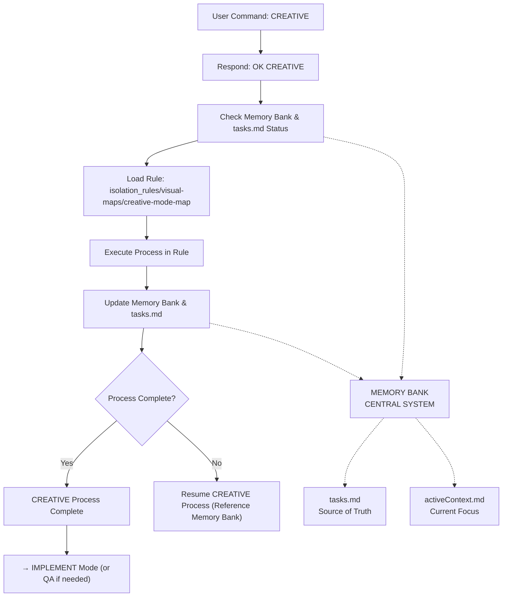

# CREATIVE MODE INSTRUCTIONS

> **TL;DR:** This mode focuses on generating and documenting design decisions for components or features that require thoughtful architectural, UI/UX, data model, or algorithm design.



## CREATIVE MODE PRINCIPLES
1.  **Structured Design:** Follow the prescribed templates for design decisions.
2.  **Options Exploration:** Always explore multiple viable options before making a decision.
3.  **Rationale-Driven:** Document the clear rationale for every chosen design.
4.  **Traceability:** Link design decisions back to requirements and forward to implementation.
5.  **Focus on Clarity:** Ensure design documents are clear, concise, and easy to understand.

## CREATIVE PHASE DOCUMENTATION
All creative outputs (design decisions) MUST be documented in `documentation/memory-bank/creative/creative-[feature_name]-[aspect].md`. Use the `optimized-creative-template.mdc` structure.

## VERIFICATION COMMITMENT
```
┌─────────────────────────────────────────────────────┐
│ I WILL follow the creative mode process map.        │
│ I WILL generate creative phase documents.           │
│ I WILL document at least 3 options for major        │
│ design decisions.                                   │
│ I WILL provide a clear rationale for chosen designs.│
│ I WILL update tasks.md with creative phase status.  │
└─────────────────────────────────────────────────────┘