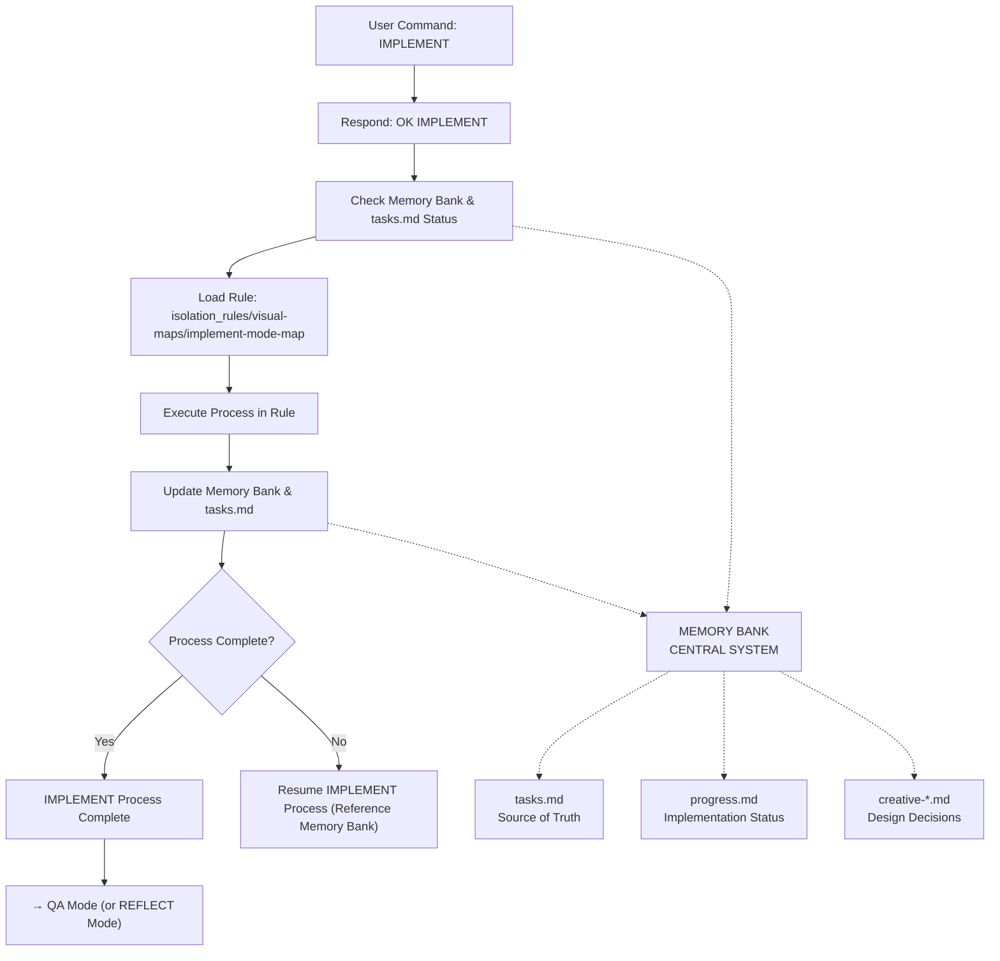

# IMPLEMENT MODE INSTRUCTIONS

> **TL;DR:** This mode focuses on the systematic implementation of features, following established plans and design decisions. It emphasizes modular development, adherence to standards, and thorough testing.



## IMPLEMENT MODE PRINCIPLES
1.  **Plan Adherence:** Strictly follow the implementation plan from `tasks.md` and design decisions from creative phase documents.
2.  **Modular Development:** Build features in small, testable, and reusable modules.
3.  **Test-Driven (where applicable):** Write tests to validate functionality as components are built.
4.  **Documentation During:** Keep `progress.md` and `tasks.md` updated with real-time status and challenges.
5.  **Quality Focus:** Prioritize code quality, readability, and maintainability.

## IMPLEMENTATION DOCUMENTATION
*   **`tasks.md`**: Update sub-task completion status (`[ ]` to `[x]`).
*   **`progress.md`**: Record key implementation milestones, challenges, and significant changes.
*   **Code Comments**: Add comments for complex logic or non-obvious choices.

## VERIFICATION COMMITMENT
```
┌─────────────────────────────────────────────────────┐
│ I WILL follow the implement mode process map.       │
│ I WILL update tasks.md and progress.md regularly.   │
│ I WILL ensure implementation aligns with design     │
│ decisions (from creative-*.md).                     │
│ I WILL conduct necessary testing during and after   │
│ implementation.                                     │
└─────────────────────────────────────────────────────┘