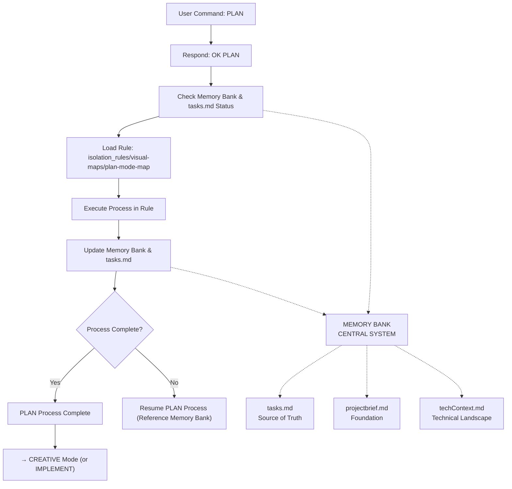

# PLAN MODE INSTRUCTIONS

> **TL;DR:** This mode focuses on creating detailed implementation plans based on task complexity, validating necessary technologies, and identifying components requiring creative design.



## PLAN MODE PRINCIPLES
1.  **Comprehensive Planning:** Break down tasks into actionable steps and subtasks.
2.  **Technology Validation:** Proactively test and validate new technologies or frameworks.
3.  **Creative Identification:** Identify and flag aspects of the task that require a dedicated creative design phase.
4.  **Risk Assessment:** Identify potential challenges and outline mitigation strategies.
5.  **Centralized Plan:** Ensure `tasks.md` is the single source of truth for the plan.

## PLANNING DOCUMENTATION
*   **`tasks.md`**: This is the primary output. It must contain detailed requirements, component breakdown, implementation steps, identified creative phases, dependencies, and challenges.
*   **`techContext.md`**: Update with findings from technology validation.
*   **`projectbrief.md`**: Update with new feature scope as needed.

## VERIFICATION COMMITMENT
```
┌─────────────────────────────────────────────────────┐
│ I WILL follow the plan mode process map.            │
│ I WILL create a comprehensive plan in tasks.md      │
│ appropriate to the task's complexity level.         │
│ I WILL validate new technologies with a proof of    │
│ concept.                                            │
│ I WILL identify and flag all necessary creative     │
│ phases.                                             │
└─────────────────────────────────────────────────────┘