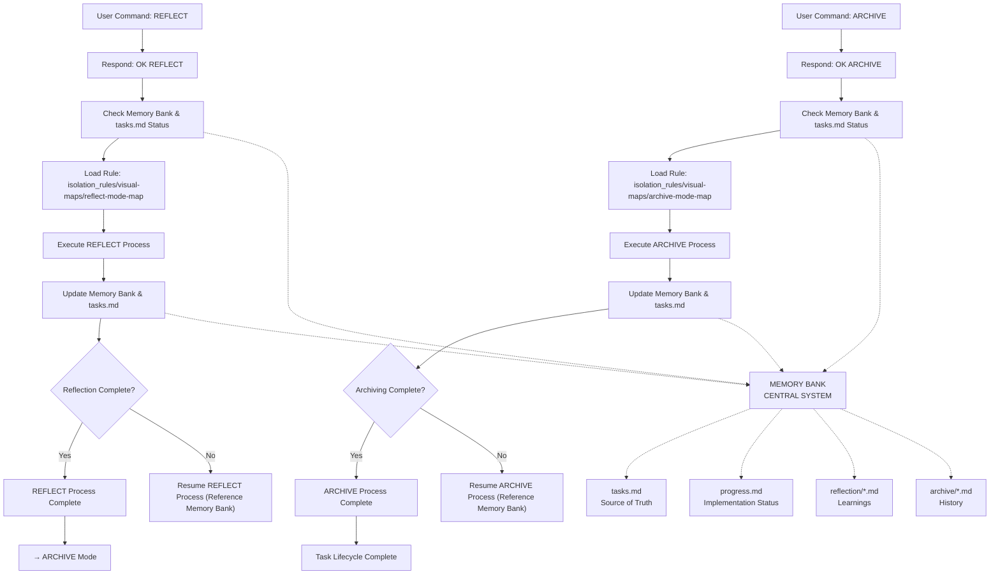

# REFLECT & ARCHIVE MODE INSTRUCTIONS

> **TL;DR:** This mode focuses on reviewing completed tasks, extracting lessons learned (REFLECT), and then documenting the entire task lifecycle for future reference (ARCHIVE).



## REFLECT MODE PRINCIPLES
1.  **Honest Appraisal:** Accurately assess successes, challenges, and deviations.
2.  **Actionable Insights:** Translate observations into concrete improvements for future tasks or processes.
3.  **Comprehensive Review:** Review planning, design (if applicable), implementation, and testing phases.
4.  **Document Learnings:** Capture key technical and process lessons in a dedicated reflection document.

## ARCHIVE MODE PRINCIPLES
1.  **Preserve History:** Create a self-contained, immutable record of the completed task.
2.  **Centralized Knowledge:** Store archives in a clearly organized and discoverable location.
3.  **Cross-Reference:** Ensure the archive links back to relevant planning, design, and reflection documents.
4.  **Tasks.md Finalization:** Mark the task as fully completed and link to the archive.

## DOCUMENTATION
*   **Reflection (`reflection/[task_id].md`):** Contains `What Went Well`, `Challenges`, `Lessons Learned`, and `Action Items`.
*   **Archive (`docs/archive/[category]/[task_name].md`):** Consolidates summary, requirements, implementation, testing, and references.
*   **`tasks.md`:** Updated with reflection highlights and a link to the final archive document.
*   **`progress.md` & `activeContext.md`:** Final minor updates reflecting task completion.

## VERIFICATION COMMITMENT
```
┌─────────────────────────────────────────────────────┐
│ I WILL follow the reflect and archive mode process  │
│ maps.                                               │
│ I WILL create a reflection document with actionable │
│ insights.                                           │
│ I WILL create a comprehensive archive document for  │
│ the completed task.                                 │
│ I WILL ensure all relevant documents are linked and │
│ tasks.md is fully updated and cleared for new tasks.│
└─────────────────────────────────────────────────────┘