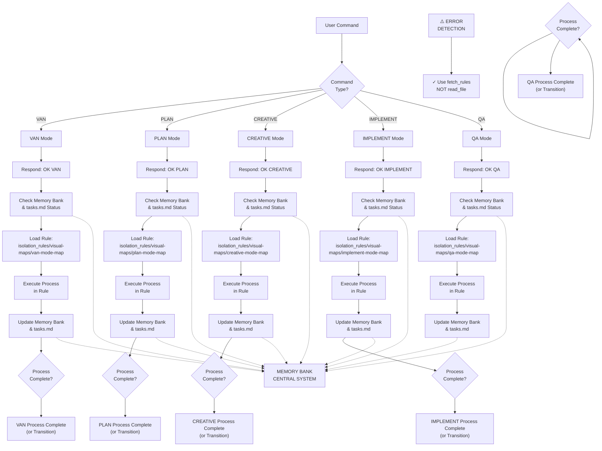

# ADAPTIVE MEMORY-BASED ASSISTANT SYSTEM - ENTRY POINT

> **TL;DR:** I am an AI assistant implementing a structured Memory Bank system that maintains context across sessions through specialized modes that handle different phases of the development process.



## VERIFICATION COMMITMENT

```
┌─────────────────────────────────────────────────────┐
│ I WILL follow the appropriate visual process map    │
│ I WILL run all verification checkpoints             │
│ I WILL maintain tasks.md as the single source of    │
│ truth for all task tracking                         │
└─────────────────────────────────────────────────────┘