# Core Utilities and Operations

> **TL;DR:** This is a collection of common, reusable instructions for file operations, command execution, and platform awareness that are referenced by all modes.

## 1. Memory Bank & File Structure

**CRITICAL:** All core Memory Bank files reside within the `documentation/memory-bank/` directory.

-   **Tasks File:** `documentation/memory-bank/tasks.md` (The single source of truth for task status)
-   **Active Context:** `documentation/memory-bank/activeContext.md`
-   **Creative Docs:** `documentation/memory-bank/creative/`
-   **Archive:** `documentation/memory-bank/archive/`

### File Verification & Creation

Use batch operations to efficiently verify and create the required file structure.

```mermaid
graph TD
    Start["Verify Structure"] --> Check{"Missing<br>Components?"};
    Check -->|"No"| Complete["✓ Verified"];
    Check -->|"Yes"| BatchCreate["Batch Create<br>All Missing Items"];
    BatchCreate --> Report["Report Creation"] --> Complete;
```



**Bash/Zsh (Mac/Linux):**
```bash
# Create directories and files in one go
mkdir -p documentation/memory-bank/creative docs/archive
touch tasks.md documentation/memory-bank/activeContext.md documentation/memory-bank/progress.md
```

**PowerShell (Windows):**
```powershell
# Create directories
mkdir documentation\memory-bank, docs, docs\archive -ErrorAction SilentlyContinue
# Create files
$files = "tasks.md", "documentation\memory-bank\activeContext.md", "documentation\memory-bank\progress.md"
foreach ($file in $files) {
    if (-not (Test-Path $file)) { New-Item -Path $file -ItemType File -Force }
}
```

## 2. Command Execution

Balance clarity and token optimization. Use command chaining for efficiency.

### Command Chaining Patterns
| Pattern | Format | Example | Use Case |
|---|---|---|---|
| **Sequential** | `cmd1 && cmd2` | `mkdir dir && cd dir` | Run `cmd2` only if `cmd1` succeeds. |
| **Piping** | `cmd1 \| cmd2` | `ls \| grep ".md"` | Use output of `cmd1` as input for `cmd2`. |
| **Conditional**| `cmd1 \|\| cmd2` | `test -f file.txt \|\| touch file.txt` | Run `cmd2` only if `cmd1` fails. |
| **Multi-arg** | `cmd arg1 arg2` | `npm install lib1 lib2` | Use a command's built-in multi-argument support. |

### Command Documentation
When showing work, document commands and their results concisely.
```markdown
### Command: Create React App
`npm create vite@latest my-react-app -- --template react`
**Result:** Successfully created a new React project in `./my-react-app`.
**Next:** Proceed with `cd my-react-app && npm install`.
```

## 3. Platform Awareness

Detect the OS and adapt commands accordingly.

