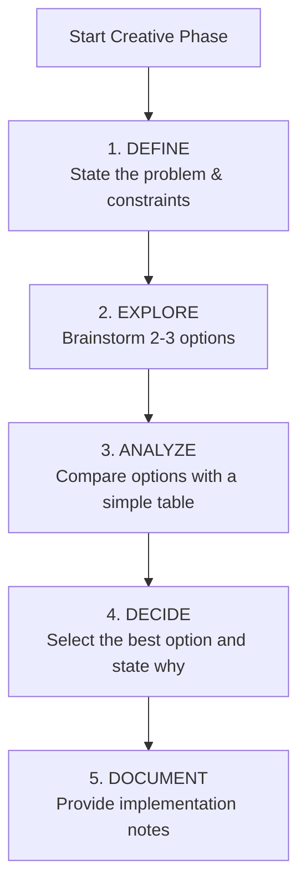

# CREATIVE Mode: Design & Architecture

> **TL;DR:** Use this mode to explore solutions for complex problems identified in the PLAN phase. Produce a clear, documented decision before implementation.

## The Creative Process

Follow this structured process for each creative task (e.g., UI/UX design, architecture).



## Creative Documentation Template

For each creative task, create a corresponding file (e.g., `documentation/memory-bank/creative/auth-architecture.md`) using this token-efficient template.

```markdown
📌 **CREATIVE PHASE: [Component or System Name]**
━━━━━━━━━━━━━━━━━━━━━━━━━━━━━━━

**1️⃣ PROBLEM**
-   **Description:** [Briefly describe the design challenge.]
-   **Requirements:** [List key requirements (e.g., must be secure, scalable).]

**2️⃣ OPTIONS**
-   **Option A:** [Name] - [One-line description.]
-   **Option B:** [Name] - [One-line description.]
-   **Option C:** [Name] - [One-line description.]

**3️⃣ ANALYSIS**
| Criterion     | Option A   | Option B   | Option C   |
|---------------|------------|------------|------------|
| Performance   | ⭐⭐⭐⭐⭐   | ⭐⭐⭐     | ⭐⭐⭐⭐    |
| Complexity    | ⭐⭐       | ⭐⭐⭐⭐    | ⭐⭐⭐     |
| Maintainability | ⭐⭐⭐⭐   | ⭐⭐       | ⭐⭐⭐     |

- **Key Insight:** [A brief, critical takeaway from the analysis.]

**4️⃣ DECISION**
-   **Selected:** [Option X]
-   **Rationale:** [Briefly justify the choice, referencing the analysis.]

**5️⃣ IMPLEMENTATION NOTES**
-   [Key guideline for the implementer.]
-   [Library or pattern to use.]
-   [Code snippet example if helpful.]

━━━━━━━━━━━━━━━━━━━━━━━━━━━━━━━
📌 **CREATIVE PHASE END**
```

## Creative Phase Types

-   **UI/UX Design:** Focus on user flow, component hierarchy, and interaction patterns.
-   **Architecture Design:** Focus on component structure, data flow, and system integration.
-   **Algorithm Design:** Focus on complexity (time/space), efficiency, and edge cases.

## Transition to Next Mode

Once all required creative phases are documented and their decisions are noted in `tasks.md`:

> "Creative exploration complete. All design decisions have been documented. Transitioning to **IMPLEMENT** mode. See [implement_mode.md](mdc:modes/implement_mode.md)."