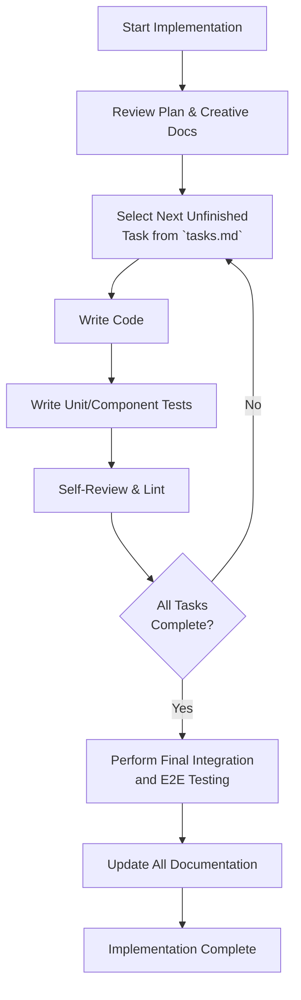

# IMPLEMENT Mode: Build & Code

> **TL;DR:** Use this mode to write code based on the artifacts from the PLAN and CREATIVE modes. Follow the implementation plan in `tasks.md` and update it as you go.

## Implementation Workflow

Work through the implementation plan systematically.

## Key Principles

-   **Follow the Plan:** Strictly adhere to the implementation steps in `tasks.md` and the design decisions in the `documentation/memory-bank/creative/` files.
-   **Update Progress:** After completing a significant subtask, mark it as complete in `tasks.md` and add a brief note to `documentation/memory-bank/progress.md`.
-   **Modularity:** Build features in well-defined, loosely-coupled modules or components.
-   **Testing:** Write tests alongside your code. The type of testing depends on the complexity:
    -   **Level 1:** Focus on manual verification and basic unit tests for the fix.
    -   **Level 2:** Write unit tests for new logic.
    -   **Level 3-4:** Write unit tests, component tests (for UI), and integration tests.
-   **Utilities:** Reference **[core_utilities.md](mdc:modes/core_utilities.md)** for efficient command execution patterns.

## Transition to Next Mode

Once all implementation and testing tasks in `tasks.md` are complete:

> "Implementation and testing complete. Transitioning to **QA** mode for final validation. See [qa_mode.md](mdc:modes/qa_mode.md)."