# PLAN Mode: Task Planning

> **TL;DR:** Use this mode to create a detailed implementation plan. The depth of the plan depends on the complexity level determined in VAN mode. This mode concludes with a mandatory technology validation step.

## 1. Planning by Complexity Level

Refer to `tasks.md` for the complexity level and create a plan with the appropriate detail.

### Level 2: Simple Enhancement Plan
- **Goal:** Document the changes and create a simple checklist.
- **`tasks.md` update:**
  ```markdown
  ### Plan: [Enhancement Name]
  - **Objective:** [Briefly describe the goal]
  - **Affected Files:**
    - `path/to/file1.js`
  - **Checklist:**
    - [ ] Implement the UI change.
    - [ ] Add basic unit test.
    - [ ] Verify in browser.
  ```

### Level 3: Intermediate Feature Plan
- **Goal:** Break the feature into components, define requirements, and identify parts that need creative exploration.
- **`tasks.md` update:**
  ```markdown
  ### Plan: [Feature Name]
  - **Requirements:**
    - [ ] User can upload an avatar.
    - [ ] Image must be < 2MB.
  - **Component Breakdown:**
    - `AvatarUploadButton.tsx`: Handles file selection.
    - `ImagePreview.tsx`: Shows the selected image.
    - `useAvatarUpload.ts`: Hook for upload logic.
  - **Creative Phases Required:**
    - [ ] UI/UX for the upload modal.
  - **Implementation Steps:**
    - [ ] Build UI components.
    - [ ] Implement the upload hook with API call.
    - [ ] Add state management.
    - [ ] Write integration tests.
  ```

### Level 4: Complex System Plan
- **Goal:** Create an architectural plan, define subsystems, map dependencies, and assess risks.
- In addition to the Level 3 items, add:
  - **Architecture Diagrams:** Use MermaidJS to show component/data flow.
  - **Phased Rollout:** Plan for a staged implementation.
  - **Risk Assessment:** Document potential risks and mitigation strategies.

## 2. Technology Validation (Mandatory Gate)

Before finishing the PLAN phase, you **must** validate the chosen technology stack. This prevents major issues during implementation.

```mermaid
graph TD
    A["Select Tech Stack"] --> B["Create 'Hello World'<br>Proof of Concept"];
    B --> C{"Build & Run<br>Successful?"};
    C -->|"No"| D["Fix Setup/Config<br>Issues"];
    D --> B;
    C -->|"Yes"| E["✓ Tech Validated"];
```



### Tech Validation Checklist
-   [ ] Project initialization command verified (`npm create vite@latest`).
-   [ ] Required dependencies identified and installed (`npm install`).
-   [ ] "Hello World" app builds and runs successfully (`npm run dev`).
-   [ ] **`tasks.md`** updated to confirm technology stack is validated.

## 3. Transition to Next Mode

-   **If Creative Phases were identified:**
    > "Planning complete and technology validated. Creative exploration is required. Transitioning to **CREATIVE** mode. See [creative_mode.md](mdc:modes/creative_mode.md)."
-   **If No Creative Phases are needed:**
    > "Planning complete and technology validated. Ready for implementation. Transitioning to **IMPLEMENT** mode. See [implement_mode.md](mdc:modes/implement_mode.md)."