# QA Mode: Technical Validation

> **TL;DR:** Before marking the task as complete, run these automated and manual checks to ensure the technical foundation is solid. This is a gate before the final reflection and archive.

## QA Validation Process

This is a four-point validation process. Execute each step in order.

```mermaid
graph TD
    Start["Start QA"] --> A["1. Dependency Verification"];
    A --> B["2. Configuration Validation"];
    B --> C["3. Environment Validation"];
    C --> D["4. Minimal Build Test"];
    D --> E{"All Checks Pass?"};
    E -->|"Yes"| F["✓ QA PASSED"];
    E -->|"No"| G["❌ QA FAILED"];
    G --> H["Fix Issues Using<br>Common Fixes Guide"];
    H --> Start;
```



---
### **1. Dependency Verification**
- **Goal:** Ensure all required dependencies are installed and versions are compatible.
- **Check:**
  - `node` and `npm` (or other runtimes) are installed and meet version requirements.
  - Run `npm install` (or equivalent) to ensure all project packages are present and there are no resolution errors.
- **On Fail:** Install or update dependencies as needed.

---
### **2. Configuration Validation**
- **Goal:** Validate that configuration files (`package.json`, `tsconfig.json`, etc.) have correct syntax and are compatible.
- **Check:**
  - JSON files are parsable.
  - Config files contain required project-specific settings (e.g., React plugin in `vite.config.js`).
- **On Fail:** Correct syntax errors or add missing configurations.

---
### **3. Environment Validation**
- **Goal:** Verify the build environment has the necessary tools and permissions.
- **Check:**
  - Required CLI tools (e.g., `git`) are installed.
  - Write permissions exist in the project directory.
  - Required network ports (e.g., 3000 for dev server) are available.
- **On Fail:** Install missing tools or resolve permission/port conflicts.

---
### **4. Minimal Build Test**
- **Goal:** Run a minimal, isolated build to confirm the toolchain works.
- **Check:**
  - A minimal "hello world" version of the project can be built successfully.
  - The built artifact runs without crashing.
- **On Fail:** Debug the build process. Check logs for specific error messages.

---
## Reporting and Transition

- **On Success:**
  ```markdown
  ╔═════════════════ 🔍 QA VALIDATION REPORT ══════════════════╗
  │ ✅ FINAL VERDICT: PASS                                      │
  │ ➡️ Clear to proceed to REFLECT & ARCHIVE mode.             │
  ╚════════════════════════════════════════════════════════════╝
  ```
  > "QA validation passed. Transitioning to **REFLECT & ARCHIVE** mode. See [reflect_archive_mode.md](mdc:modes/reflect_archive_mode.md)."

- **On Failure:**
  ```markdown
  ⚠️⚠️⚠️ QA VALIDATION FAILED ⚠️⚠️⚠️
  - **Issues Found:** [List of failed checks and specific errors]
  - **Action:** Resolve the issues listed above and re-run QA validation.
  ```