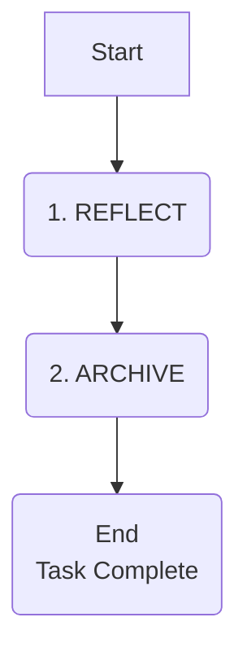

# REFLECT & ARCHIVE Mode

> **TL;DR:** After implementation is complete, use this mode to reflect on the process and create a final archive document. This closes out the task.

## The Two-Step Process

This mode has two distinct steps: Reflection (learning) and Archiving (documenting).



---
## 1. Reflection: Learn from the Process

Answer these questions to extract key lessons. The goal is continuous improvement. Create a `reflection-[task_id].md` file in the memory bank.

### Reflection Template (scale detail with task complexity)

-   **What was the goal vs. the outcome?**
    -   Did we successfully meet all requirements? Were there any scope changes?
-   **What went well?**
    -   (e.g., "The component-based plan made implementation very smooth.")
-   **What were the biggest challenges?**
    -   (e.g., "The external API had undocumented rate limits, which caused delays.")
-   **Key Technical Lesson:**
    -   (e.g., "Learned that Zustand is a much simpler state management solution for this type of feature.")
-   **Actionable Improvement for Next Time:**
    -   (e.g., "Always perform a load test on external APIs before integrating them.")

---
## 2. Archiving: Document for the Future

Create a final archive file in `docs/archive/`. This document should be a self-contained summary of the feature.

### Archive Template

```markdown
# Archive: [Feature Name] - [YYYY-MM-DD]

## 1. Summary
- **Description:** A brief, one-paragraph summary of the feature and its purpose.
- **Complexity Level:** [1/2/3/4]

## 2. Links to Key Documents
- **Reflection:** `link/to/reflection.md`
- **Creative Decisions:** `link/to/creative-docs...`
- **Final Code:** `link/to/pull-request` or commit hash.

## 3. Implementation Overview
- **Key Components Created:**
  - `ComponentA.tsx`: [Purpose]
  - `useFeature.ts`: [Purpose]
- **Technology Used:** [List of key libraries/frameworks]

## 4. Final Status
- **Status:** COMPLETED & ARCHIVED
```

## Task Completion

After the archive is created and `tasks.md` is updated to show completion:

> "Task is now fully reflected upon and archived. The Memory Bank is clean and ready for the next task. To start, use the **VAN** command."