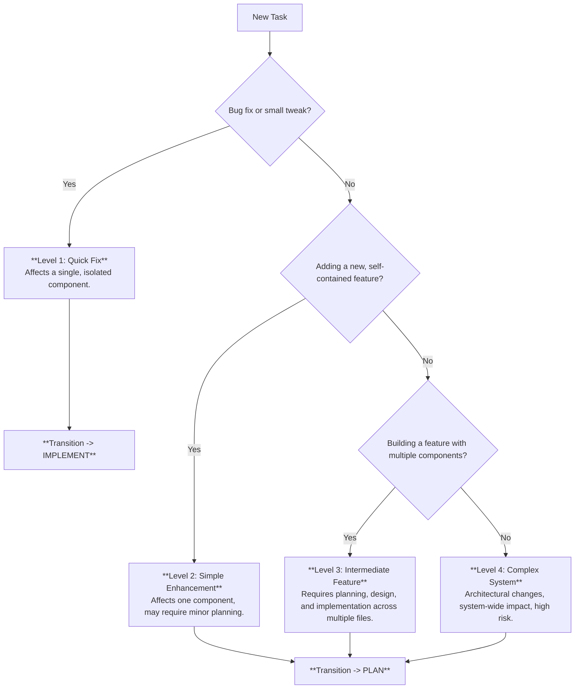

# VAN Mode: Analyze & Triage

> **TL;DR:** Use this mode to analyze a new task, determine its complexity, and decide the correct workflow path. This is the starting point for ALL tasks.

## 1. Task Intake & Complexity Analysis

First, analyze the user's request to determine its complexity level. This decision dictates the entire workflow.

### Complexity Level Indicators

| Level | Keywords | Scope | Example | Next Mode |
|---|---|---|---|---|
| **1: Quick Fix** | fix, bug, error | Single component | Fix a broken button | **IMPLEMENT** |
| **2: Enhancement**| add, improve, update | 1-2 components | Add a new field to a form | **PLAN** |
| **3: Feature** | implement, create | Multiple components | Build a user profile page | **PLAN** |
| **4: System** | architecture, redesign | System-wide | Implement a new auth system | **PLAN** |

## 2. Initial Setup (All Levels)

Before transitioning, perform these initial setup steps. Reference **[core_utilities.md](mdc:modes/core_utilities.md)** for detailed commands.

1.  **Verify/Create Memory Bank:** Ensure the `documentation/memory-bank/` directory and its core files (`tasks.md`, `activeContext.md`) exist. This is a **mandatory** step.
2.  **Initialize `tasks.md`:** Create an entry for the new task, including a brief description and the determined complexity level.
3.  **Update `activeContext.md`:** Set the current focus to the new task.

## 3. Transition to Next Mode

Based on the complexity assessment, announce the transition.

-   **If Level 1:**
    > "This is a Level 1 task. Transitioning directly to **IMPLEMENT** mode. See [implement_mode.md](mdc:modes/implement_mode.md)."

-   **If Level 2, 3, or 4:**
    > "This is a Level [2/3/4] task. Planning is required. Transitioning to **PLAN** mode. See [plan_mode.md](mdc:modes/plan_mode.md)."